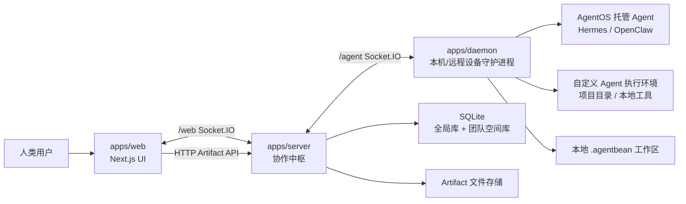
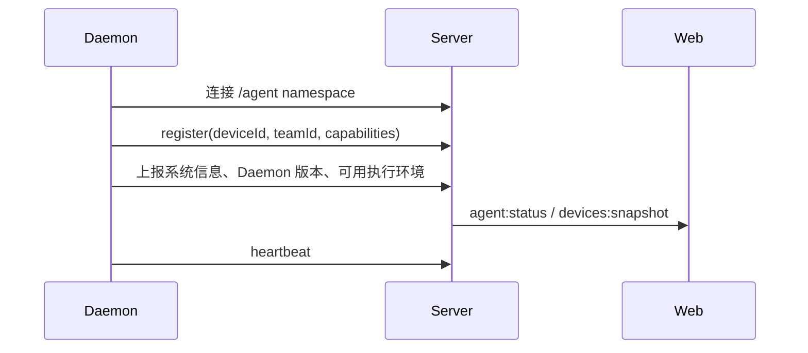
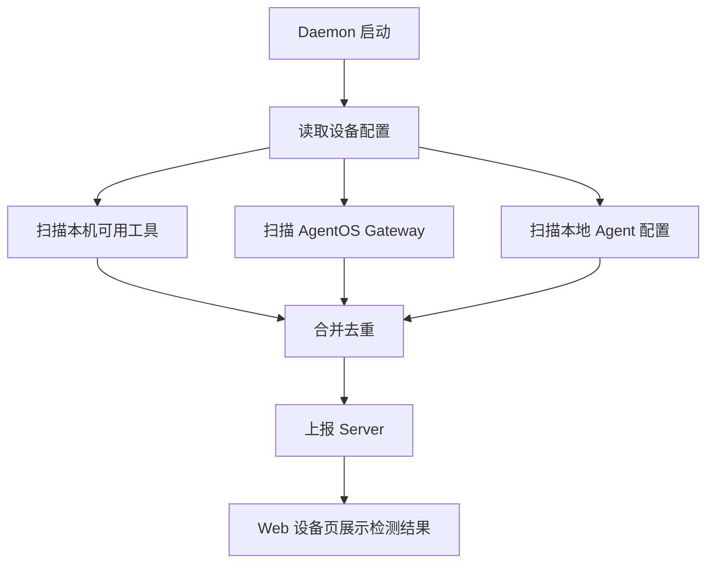
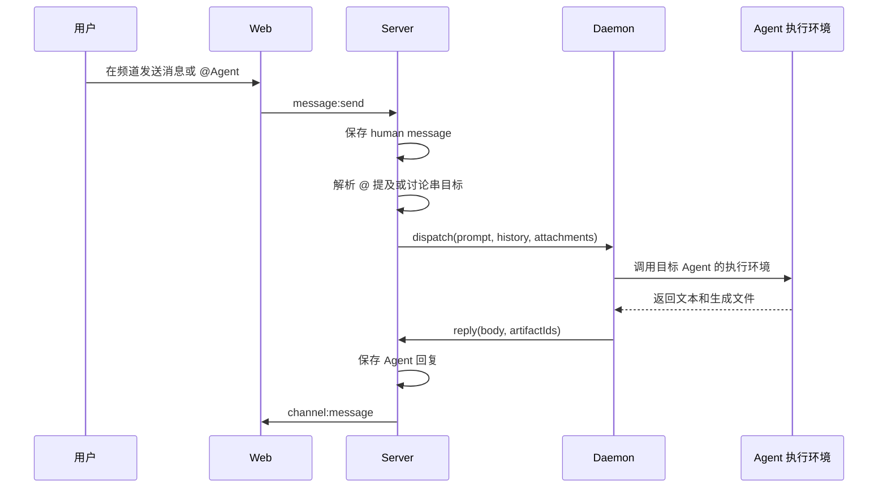
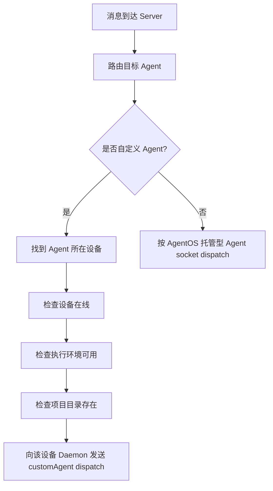
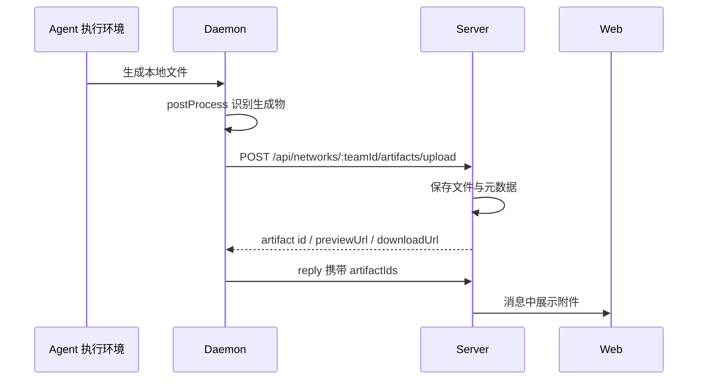

# AgentBean

AgentBean 是一个面向人类与 Agent 协作的本地优先团队平台。它最大的特点是：人类成员、本机上的 Agent、远程设备上的 Agent 都可以在同一个 Team 中无缝协作。

在 AgentBean 中，频道、私聊、讨论串、任务、文件产物、成员和设备状态都归属于 Team。Agent 可以运行在当前用户的设备上，也可以运行在其他在线设备上；用户只需要在同一个协作界面里 @ 它、私聊它、查看它的任务和产物。

产品层的 Agent 主要有两种形态：

- **AgentOS 托管型 Agent**：由 OpenClaw、Hermes 等 AgentOS / Gateway 托管，可以作为团队成员响应频道或私聊消息。
- **自定义 Agent**：用户创建的专属 Agent，连接某台设备上的项目目录和本地工具，把个人工作流转化为团队可协作的能力。

## 仓库结构

```text
AgentBean/
  apps/
    web/       Next.js 前端，提供聊天、成员、设备、任务和设置页面
    server/    Express + Socket.IO 协作中枢，负责认证、路由、存储和文件 API
    daemon/    运行在用户设备上的 Daemon，连接设备、执行 Agent 任务并同步产物
```

## 总体架构



核心设计：

- **Web 只负责交互**：频道、私聊、讨论串、任务、文件、成员、设备页面都通过 Socket.IO 和 HTTP API 与 Server 通信。
- **Server 是协作中枢**：管理团队、成员、频道、消息、DM、Agent 状态、任务、Artifact 元数据和消息路由。
- **Daemon 是设备桥梁**：连接本机或远程设备，执行自定义 Agent 或 AgentOS 托管型 Agent，并把输出、文件、状态同步回 Server。
- **团队隔离存储**：每个 Team 有独立的消息、频道、任务、Artifact 空间；全局库保存用户、团队、设备和 Agent 配置。
- **本地工作区优先**：每个设备会为 Team/Agent 创建本地 `.agentbean` 工作区，用于存放生成物、中间产物和同步文件。

## 主要功能

### 聊天

- 频道聊天和 Agent 私聊。
- 支持 `@Agent` 提及。
- 支持消息讨论串。
- 支持讨论串中继续与 Agent 交互。
- 支持图片和文件附件上传。
- 支持收藏消息、活动视图、搜索、任务视图和文件视图。
- Agent 回复可以携带生成文件，图片可预览，文件可下载。

### 成员

- 人类成员列表。
- Agent 成员列表。
- 当前登录用户在人类成员列表中显示“（你）”。
- Agent 详情页包含：
  - 资料
  - 权限
  - 智能体私聊
  - 提醒
  - 工作区
  - 动态
- 自定义 Agent 在线状态基于：
  - 所在设备在线
  - 所选执行环境在设备上可用
  - 项目目录存在

### 设备

- 设备列表和设备详情页。
- 设备详情显示 Daemon 版本、系统信息和执行环境检测结果。
- 设备能力检测区域用于列出该设备上可用于执行自定义 Agent 的本地工具。
- AgentOS 托管型 Agent 和自定义 Agent 分区展示。
- 可查看和编辑自定义 Agent 基本配置。

### 自定义 Agent

- 用户可以创建自定义 Agent。
- 创建字段：
  - 名称
  - 功能介绍
  - 执行环境
  - 项目目录
- 自定义 Agent 可以发布到 Team。
- 自定义 Agent 发布到 Team 后，会作为团队里的 Agent 成员出现；它背后的设备和工具只负责执行任务。

### 工作区与文件产物

- Daemon 会为 Agent 任务创建运行工作区。
- Agent 生成的图片、文档等文件会通过 Daemon 上传到 Server Artifact API。
- Server 保存 Artifact 元数据和下载/预览地址。
- Web 在消息、讨论串、文件视图和 Agent 工作区中展示这些产物。
- Daemon 会同步 Team 工作区中的产物，便于不同设备上的同一 Team 成员查看。

## 关键流程

### 设备接入流程



### 设备能力扫描流程



### 频道消息到 Agent 回复



讨论串中特别注意：当前用户输入只作为 `prompt` 发送，历史 `history` 不再重复包含当前消息，避免 Hermes 等 CLI 把上下文原样回显进回复。

### 自定义 Agent Dispatch



### 文件产物流程



## Server 设计

`apps/server` 是系统的协作中枢。

核心职责：

- 用户、Team、设备和 Agent 配置管理。
- Socket.IO `/web` namespace：面向前端。
- Socket.IO `/agent` namespace：面向 Daemon。
- 频道、DM、讨论串和任务消息持久化。
- Agent 路由与 dispatch。
- Agent 状态和性能指标收集。
- Artifact 上传、下载、预览和工作区查询。

存储分层：

- **全局数据库**：用户、Team、成员关系、设备、自定义 Agent 配置。
- **Team Space 数据库**：频道、频道成员、DM、消息、任务、Artifact 元数据。
- **Artifact 文件目录**：保存上传文件，并提供下载和预览接口。

## Web 设计

`apps/web` 是 Next.js 14 应用。

核心页面：

- `/[team]/chat`：聊天、频道、私聊、搜索、活动、收藏、任务、文件。
- `/[team]/members`：成员列表和成员详情。
- `/[team]/agent/[agentId]`：从成员页进入的 Agent 详情。
- `/[team]/human/[userId]`：人类成员详情。
- `/[team]/devices`：设备列表和设备详情。
- `/[team]/settings`：Team 设置。
- `/[team]/tasks`：任务视图。

前端状态：

- Zustand 保存连接状态、Agent 快照、设备快照、频道、DM、消息、当前 Team 和当前用户。
- Socket.IO 负责实时事件。
- Artifact 预览和下载通过 Server HTTP API。

## Daemon 设计

`apps/daemon` 运行在用户设备上，npm 包名为 `@agentbean/daemon`。

核心职责：

- 扫描本机可用执行环境：
  - Claude Code
  - Codex CLI
  - Kimi CLI
  - Hermes
  - OpenClaw
- 向 Server 注册设备和能力。
- 维护心跳和在线状态。
- 执行 Server 下发的 dispatch。
- 为自定义 Agent 切换到项目目录并调用所选执行环境。
- 处理附件下载和生成文件上传。
- 同步 `.agentbean` 工作区产物。

当前发布状态：

- 官方 npm registry 中 `@agentbean/daemon@0.1.17` 已发布。
- 如果本机 npm registry 使用 `npmmirror`，可能会暂时只看到旧版本；以 `https://registry.npmjs.org` 为准。

## 本地开发

分别进入三个应用目录安装和运行：

```bash
cd apps/server
npm install
npm run dev
```

```bash
cd apps/web
npm install
npm run dev
```

```bash
cd apps/daemon
npm install
npm run dev
```

默认端口：

- Web: `http://localhost:3100`
- Server: `http://localhost:4000`

## 常用验证

```bash
cd apps/web
npm test
npm run build
```

```bash
cd apps/server
npm test
npm run build
```

```bash
cd apps/daemon
npm test
npm run build
```

如果在受限沙箱里运行测试遇到 `getaddrinfo ENOTFOUND localhost`，需要在正常本机环境执行测试，或者确保 `/etc/hosts` 中存在 `127.0.0.1 localhost`。

## CI/CD

GitHub Actions 会在 push 到 `main` 时验证：

- `apps/web`
- `apps/server`
- `apps/daemon`

验证通过后：

- 发布 `@agentbean/daemon` 到 npm。
- 尝试部署 Server 到 Railway。

注意：Railway 偶发 `500 Internal Server Error` 会导致 deploy job 失败，这不代表 npm 发布失败。发布状态应以 npm registry 查询为准：

```bash
npm view @agentbean/daemon@latest version --registry=https://registry.npmjs.org
```
