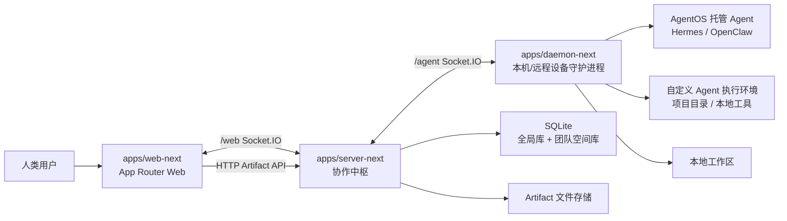
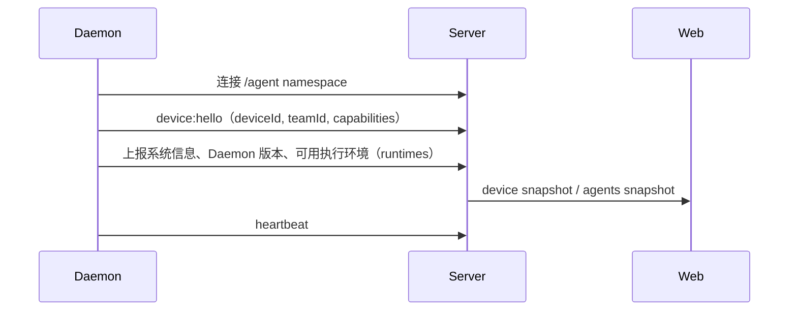
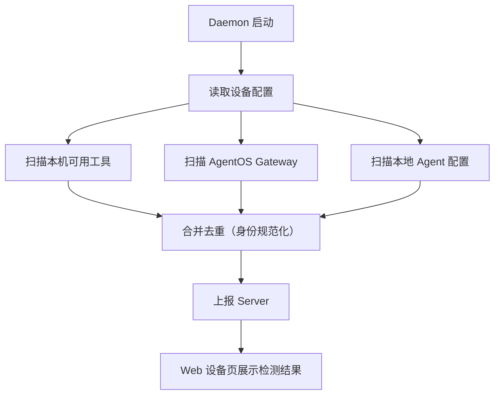
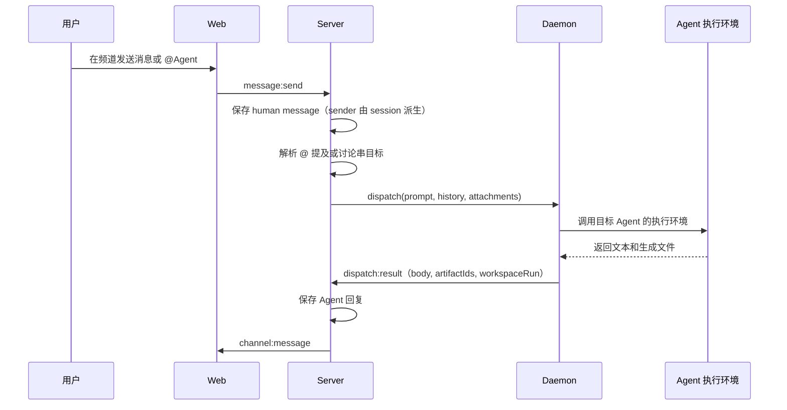
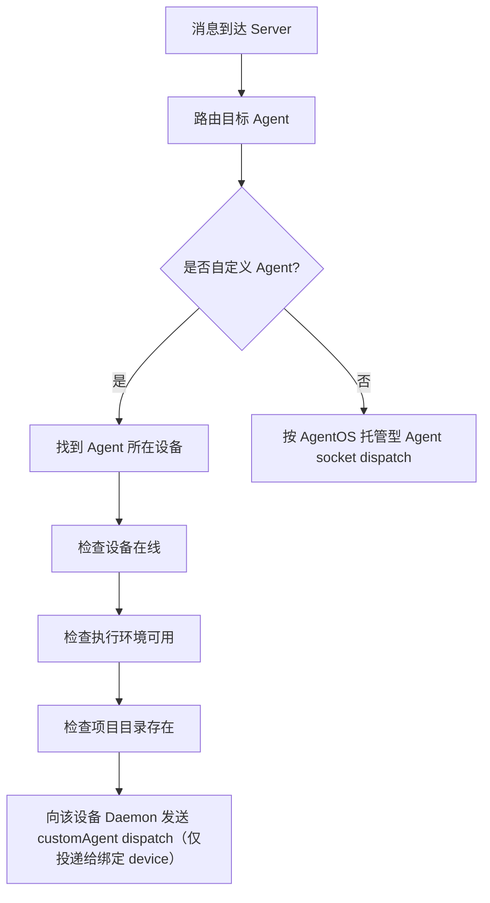
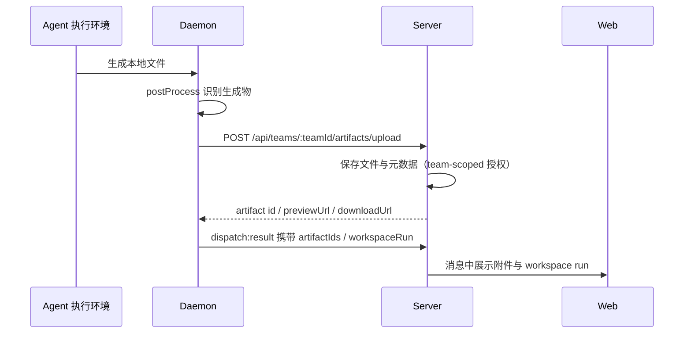

# AgentBean

AgentBean 是一个面向人类与 Agent 协作的本地优先团队平台。它最大的特点是：人类成员、本机上的 Agent、远程设备上的 Agent 都可以在同一个 Team 中无缝协作。

在 AgentBean 中，频道、私聊、讨论串、任务、文件产物、成员和设备状态都归属于 Team。Agent 可以运行在当前用户的设备上，也可以运行在其他在线设备上；用户只需要在同一个协作界面里 @ 它、私聊它、查看它的任务和产物。

产品层的 Agent 主要有两种形态：

- **AgentOS 托管型 Agent**：由 OpenClaw、Hermes 等 AgentOS / Gateway 托管，可以作为团队成员响应频道或私聊消息。
- **自定义 Agent**：用户创建的专属 Agent，连接某台设备上的项目目录和本地工具，把个人工作流转化为团队可协作的能力。

> **当前默认入口是 AgentBean Next**（`apps/*-next` + `packages/*`）。截至 2026-06-17 核对，生产 `https://api.agentbean.dev/` 已切换到 `server-next`，`AGENTBEAN_DEPLOY_TARGET=next` 已生效，npm canonical `@agentbean/daemon` 的 `@latest` dist-tag 已推进到基于 `daemon-next` 的 `0.2.0`。Phase -1 Release A 期间旧源码只作为限时回退参考保留，不再参与 build、deploy 或 publish；正式回退应优先使用 Git、Railway 与 npm 已发布 artifact（见文末「Legacy / Rollback」段落）。

## 仓库结构

```text
AgentBean/
  packages/
    contracts/   共享 DTO、Ack<T>、Socket.IO 事件常量、错误码
    domain/      纯领域逻辑：消息路由、Agent 身份规范化、可见性规则
  apps/
    server-next/  生产默认协作中枢（Express + Socket.IO + SQLite）
    web-next/     生产 App Router Web，由 server-next 托管
    daemon-next/  设备守护进程（npm @agentbean/daemon-next，canonical @agentbean/daemon）
    server/       [Legacy] 限时回退参考，不参与构建或部署
    web/          [Legacy] 限时回退参考，不参与构建或部署
    daemon/       [Legacy] 限时回退参考，不参与发布
  scripts/        readiness / cutover / smoke 检查与发布脚本
  agentbean-next/ 重写设计文档、slice 状态与验证矩阵
```

## 总体架构



核心设计：

- **Web 只负责交互**：频道、私聊、讨论串、任务、文件、成员、设备页面都通过 Socket.IO 和 HTTP API 与 Server 通信，不在前端做权限、频道可见性或 Agent 去重决策。
- **Server 是协作中枢**：管理团队、成员、频道、消息、DM、Agent 状态、任务、Artifact 元数据和消息路由。
- **Daemon 是设备桥梁**：连接本机或远程设备，执行自定义 Agent 或 AgentOS 托管型 Agent，并把输出、文件、状态同步回 Server。
- **团队隔离存储**：每个 Team 有独立的消息、频道、任务、Artifact 空间；全局库保存用户、团队、设备和 Agent 配置。
- **契约先行**：`packages/contracts` 定义共享 DTO 与 `Ack<T>`，server / web / daemon 三端只依赖契约，不互相反向依赖。

## 主要功能

### 聊天

- 频道聊天和 Agent 私聊。
- 支持 `@Agent` 提及。
- 支持消息讨论串。
- 支持讨论串中继续与 Agent 交互。
- 支持图片和文件附件上传。
- 支持收藏消息、消息搜索、任务视图和文件视图。
- Agent 回复可以携带生成文件，图片可预览，文件可下载。

### 成员

- 人类成员列表。
- Agent 成员列表。
- 当前登录用户在人类成员列表中显示“（你）”。
- Agent 成员角色管理：owner / admin / member，支持改角色、移除与 owner 转移。
- 自定义 Agent 在线状态基于：所在设备在线、所选执行环境在设备上可用、项目目录存在。

### 设备

- 设备列表和设备详情。
- 设备详情显示 Daemon 版本、系统信息和执行环境检测结果。
- 设备能力检测区域用于列出该设备上可用于执行自定义 Agent 的本地工具。
- AgentOS 托管型 Agent 和自定义 Agent 分区展示。
- 设备邀请（device invite）链路：创建邀请、等待 daemon、完成并投递凭据。

### 自定义 Agent

- 用户可以创建自定义 Agent。
- 创建字段：名称、功能介绍、执行环境、项目目录（可选自定义执行命令）。
- 自定义 Agent 可以发布到 Team，发布后作为团队里的 Agent 成员出现。
- 管理面：`agent:publish` / `agent:unpublish` / `agent:update-config` / `agent:delete`，遵守 owner/admin 权限，`env` 不进入 web snapshot，只以 `envKeys` 暴露，删除使用 tombstone 语义且保留历史。

### 工作区与文件产物

- Daemon 会为 Agent 任务创建运行工作区，并上报 workspace run metadata（command、cwd、exitCode、duration、脱敏日志摘要）。
- Agent 生成的图片、文档等文件会通过 Daemon 上传到 Server Artifact API。
- Server 保存 Artifact 元数据并提供 preview / download 路由，按 team membership 与 channel visibility 授权。
- Web 在消息、执行详情和诊断区的执行记录中展示这些产物与执行上下文。
- daemon-next custom command 的完整 stdout/stderr 会作为 `logs/workspace-run.log` artifact 上报，便于排障。

## 关键流程

### 设备接入流程



### 设备能力扫描流程



### 频道消息到 Agent 回复



讨论串中特别注意：当前用户输入只作为 `prompt` 发送，历史 `history` 不再重复包含当前消息，避免 Hermes 等 CLI 把上下文原样回显进回复。

### 自定义 Agent Dispatch



### 文件产物流程



## 本地开发

AgentBean Next 是默认开发入口。在仓库根目录安装并运行：

```bash
npm install

# 一键启动完整本地 preview（SQLite server-next + web-next preview + daemon-next）
npm run dev:agentbean-next

# 或只起 server-next（SQLite 模式）
npm run dev:server-next:sqlite

# 构建 packages / apps（contracts → domain → server-next → daemon-next → web-next）
npm run build:packages
```

默认端口与入口：

- Web preview：`http://localhost:4100/`（由 server-next 托管，默认端口 4100）
- 生产式启动：`npm start`（= `npm run start:server-next`，运行预构建的 `dist`；本地首次需先 `npm run build:packages`）

> 如果在受限沙箱里运行测试遇到 `getaddrinfo ENOTFOUND localhost`，需要在正常本机环境执行测试，或者确保 `/etc/hosts` 中存在 `127.0.0.1 localhost`。

## 常用验证

```bash
# readiness 契约检查（35/35）
npm run check:agentbean-next-readiness

# strict 生产切换审计（通过时 ok=true；未完成 final flip 会失败）
npm run audit:agentbean-next-cutover -- --json

# final flip 前预检（允许 pendingFinalFlip）
npm run audit:agentbean-next-ready-to-flip -- --json

# phase 测试（contracts / domain / server-next / daemon-next / web-next）
npm run test:phase1
```

更细分的测试与 smoke：

```bash
npm run test:server-next
npm run test:daemon-next
npm run test:web-next
npm run smoke:agentbean-next-browser      # 真实 Chrome 端到端
AGENTBEAN_NEXT_ENTRY_URL=http://127.0.0.1:4100 npm run smoke:agentbean-next-business
```

完整的验证矩阵与每一切片的验证证据见 `agentbean-next/docs/verification-matrix.md`。

## 生产状态与发布

以下状态是截至 2026-06-17 的核对结果；执行生产操作前请重新运行 cutover audit、smoke 与 npm registry 查询。

- 生产部署目标：`AGENTBEAN_DEPLOY_TARGET=next`（已生效）。生产入口 `https://api.agentbean.dev/` 由 `server-next` 提供服务。
- 生产切换门禁持续通过：strict cutover audit `11/11`、readiness `35/35`、public entry smoke `4/4`、business smoke `8/8`。
- npm 发布：当 `AGENTBEAN_NPM_PUBLISH_TARGET=next`（未单独设置时 CI 回退到 `AGENTBEAN_DEPLOY_TARGET`）时，CI 依次发布 `@agentbean/contracts`、`@agentbean/daemon-next`，再发布 canonical `@agentbean/daemon`（基于 daemon-next）。
  - 已发布版本：`@agentbean/contracts@0.2.0`、`@agentbean/daemon-next@0.2.0`、canonical `@agentbean/daemon@0.2.0`（指向 daemon-next，`main` 为 `./dist/apps/daemon-next/src/index.js`）。
  - npm 入口边界已收敛：canonical `@agentbean/daemon` 的 `@latest` dist-tag 已推进到 `0.2.0`，默认 `npm install @agentbean/daemon` 现在安装 daemon-next；旧守护进程 `0.1.35` 保留在 `legacy` dist-tag 作为 rollback 入口。cutover audit 的 `npm-canonical-daemon-latest-dist-tag` check 会持续验证该状态，防止回退。
  - 如果本机 npm registry 使用 `npmmirror`，可能会暂时只看到旧版本；以 `https://registry.npmjs.org` 为准：
    ```bash
    npm view @agentbean/daemon versions --registry=https://registry.npmjs.org
    npm view @agentbean/daemon dist-tags --registry=https://registry.npmjs.org
    ```

注意：Railway 偶发 `500 Internal Server Error` 会导致 deploy job 失败，这不代表 npm 发布失败。发布状态应以 npm registry 查询为准。

## CI/CD

GitHub Actions 会在 PR 和 push 到 `main` 时验证：

- AgentBean Next：`packages/*` 与 `apps/*-next` 的 readiness、phase tests、build 与 preview / business / browser smoke gate。
- Phase -1 Release A 不再构建、测试、部署或发布旧源码树；回退依赖已发布 artifact 与版本化部署记录。

合并到 `main` 且验证通过后：

- 根据 `AGENTBEAN_NPM_PUBLISH_TARGET` 发布 npm 包（next 目标会发布 contracts / daemon-next / canonical daemon）。
- 部署 `server-next` 到 Railway；旧版本恢复使用 Railway deployment rollback 或 Git 固定提交重建。
- 当 `AGENTBEAN_DEPLOY_TARGET=next` 时，部署后自动运行 AgentBean Next production smoke。

生产切换、rollback 与外部条件检查的完整步骤见 `agentbean-next/docs/production-cutover-runbook.md`。

## Legacy / Rollback（旧 AgentBean）

旧的 `apps/web`、`apps/server`、`apps/daemon` 在 Phase -1 Release A 期间只作为限时回退参考保留，**不再参与仓库 build、deploy 或 publish**。Release A 的可执行回退入口是 Git 固定提交、Railway 历史 deployment 与 npm registry 中已发布版本；Release B 会删除这些源码目录，使回退只依赖已发布 artifact。

- 旧 web 页面已不在生产提供流量；生产 Web 入口是 `server-next` 托管的 `web-next` App Router。
- npm 包名 `@agentbean/daemon` 已发布基于 daemon-next 的 `0.2.0`（canonical 入口，保留旧 `daemon` / `agentbean-daemon` bin），且 npm `@latest` dist-tag 已指向 `0.2.0`；旧守护进程 `0.1.35` 保留在 registry 的 `legacy` dist-tag 作为 rollback 入口。
- 仅在 rollback 演练或事故恢复时使用已发布 artifact，并配合 rollback smoke：

```bash
# 旧入口 rollback smoke（验证旧服务 health payload 可恢复）
AGENTBEAN_OLD_ENTRY_URL=https://<old-entry> npm run smoke:agentbean-old-entry
```

- 不要从 `main` 重新构建旧源码；默认开发只使用上文「本地开发」中的 AgentBean Next 命令。
