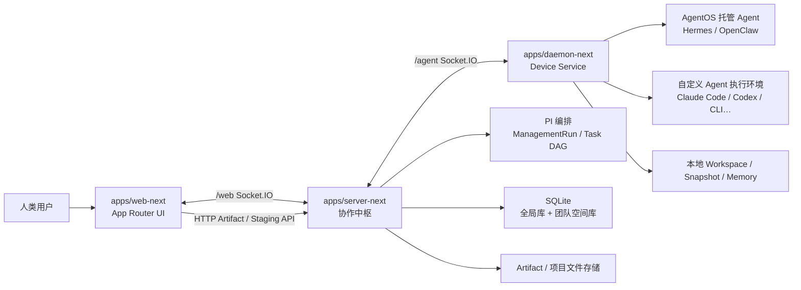
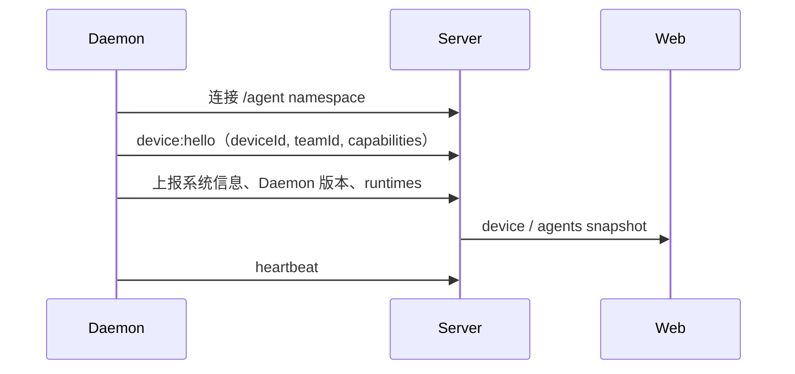
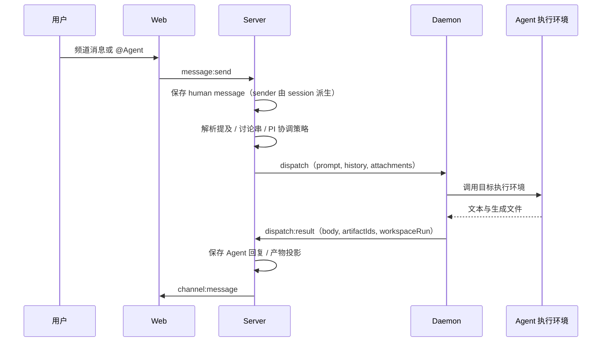
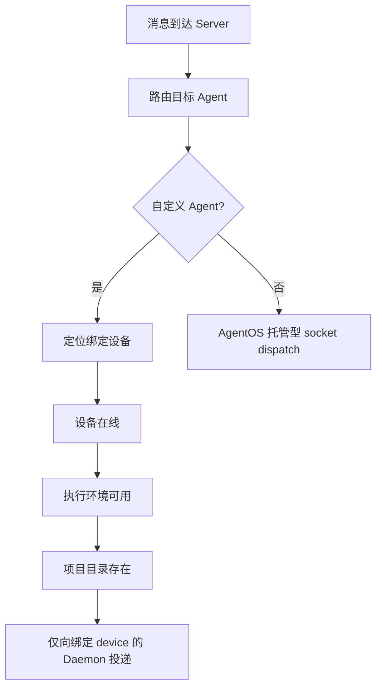
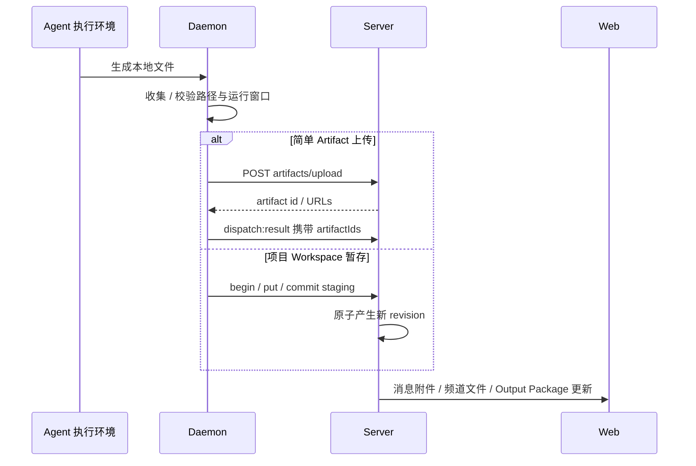

# AgentBean

AgentBean 是一个面向人类与 Agent 协作的**本地优先**团队平台。人类成员、本机 Agent、远程设备上的 Agent 可以在同一个 Team 中无缝协作。

在 AgentBean 中，频道、私聊、讨论串、任务、项目文件、产物、记忆、成员和设备状态都归属于 **Team**。Agent 可以运行在当前用户设备上，也可以运行在其他在线设备上；用户只需在同一协作界面里 @ 它、私聊它、查看任务、审核交付与产物。

产品层的 Agent 主要有两种形态：

- **AgentOS 托管型 Agent**：由 OpenClaw、Hermes 等 AgentOS / Gateway 托管，可作为团队成员响应频道或私聊。
- **自定义 Agent**：用户创建的专属 Agent，绑定某台设备上的执行环境（Claude Code、Codex、Kimi CLI、Gemini CLI、PI CLI 等）与项目目录，把个人工作流转化为团队可协作能力。

平台还内置 **PI 管理 Agent**（编排组件，不直接写用户领域代码）：理解请求、分解任务、调用外部 Agent、汇总结果，并在权限边界内编排协作记忆。

> **当前唯一产品入口是 AgentBean Next**（`apps/*-next` + `packages/*`）。  
> 生产入口 `https://api.agentbean.dev/` 由 `server-next` 提供；Web 由同一进程托管 `web-next` App Router。  
> 设备端：`@agentbean/daemon@latest` 与 `@agentbean/daemon-next` 共用同一 Device runtime。  
> 旧实现（`apps/web` / `apps/server` / `apps/daemon`）已从 `main` 退役，不再构建、测试或部署。

---

## 快速开始（设备接入 · macOS MVP）

当前 MVP 只支持 **macOS 当前用户 LaunchAgent**（无需 `sudo`）。在 Web「添加设备」对话框中复制并运行连接命令：

```bash
npm install -g @agentbean/daemon@latest && agentbean device connect \
  --invite-code '<code>' \
  --server-url '<url>' \
  --profile-id '<profile>'
```

`device connect` 会完成设备邀请、保存该 Team 的 Device Profile、安装或刷新 Device Service，并在服务就绪后退出。同一 macOS 用户的所有 Team Profile **共用一个** Device Service。

常用生命周期命令：

```bash
agentbean device install
agentbean device status
agentbean device logs --follow
agentbean device restart
agentbean device stop
agentbean device start
agentbean device uninstall
agentbean update
```

- `agentbean update`：检查 npm stable、安装精确版本，并在 LaunchAgent 已安装时安全重启；失败会尝试回装并恢复服务。
- `uninstall` 只删除 LaunchAgent 与服务 payload；Profile 凭据、Workspace、Memory、machine-id 与 outbox 会保留。
- Linux / Windows 系统服务 **不属于**当前 MVP（ADR-0036/0037：用户设备目标平台为 macOS，含 Intel x64）。

---

## 仓库结构

```text
AgentBean/
  packages/
    contracts/              共享 DTO、Ack<T>、Socket.IO 事件常量、错误码（npm 可发布）
    domain/                 纯领域策略：路由、生命周期、记忆、任务 DAG、权限等（无 IO）
    pi-management-runtime/  PI 管理运行时适配（模型适配、tool catalog、SEA 烟雾入口）
  apps/
    server-next/            生产协作中枢（Express + Socket.IO + SQLite + 托管 web-next）
    web-next/               Next.js App Router 产品 UI
    daemon-next/            设备守护进程 / Device Service（npm @agentbean/daemon）
  scripts/                  readiness / cutover / smoke / SEA / 合并门禁 / 发版辅助
  agentbean-next/docs/      重写切片状态、协议与验证矩阵、生产切换 runbook
  docs/
    adr/                    系统级架构决策记录（ADR）
    agents/                 agent 协作约定与 rollout runbook
    superpowers/            PRD、设计规格与实施计划
  railway.json              根目录 Railway 部署配置（server-next）
```

| 包 / 应用 | npm 名 | 说明 |
|-----------|--------|------|
| contracts | `@agentbean/contracts` | 三端共享契约 |
| pi-management-runtime | `@agentbean/pi-management-runtime` | PI 管理模型与工具边界 |
| daemon-next | `@agentbean/daemon-next` / canonical `@agentbean/daemon` | 设备 CLI 与 Device Service |
| server-next / web-next / domain | 仓库内私有 | 生产服务与领域逻辑 |

Node 要求：**24.x**（仓库 `engines`）。

---

## 总体架构


```mermaid
flowchart LR
  U["人类用户"] --> W["apps/web-next<br/>App Router UI"]
  W <-->|"/web Socket.IO"| S["apps/server-next<br/>协作中枢"]
  W -->|"HTTP Artifact / Staging API"| S

  S <-->|"/agent Socket.IO"| D["apps/daemon-next<br/>Device Service"]
  D --> R1["AgentOS 托管 Agent<br/>Hermes / OpenClaw"]
  D --> R2["自定义 Agent 执行环境<br/>Claude Code / Codex / CLI…"]
  D --> FS["本地 Workspace / Snapshot / Memory"]

  S --> PI["PI 编排<br/>ManagementRun / Task DAG"]
  S --> DB["SQLite<br/>全局库 + 团队空间库"]
  S --> ART["Artifact / 项目文件存储"]
```

### 职责划分

| 层 | 职责 | 不做的事 |
|----|------|----------|
| **Web** | 登录、Team 切换、频道/DM/任务/设备/设置/管理台交互；展示 Server 下发的 snapshot 与事件 | 不推断权限、Agent 去重、Task 真相或跨 Agent 路由 |
| **Server** | 认证与 membership；消息/任务/项目/记忆权威；Dispatch 与 PI 编排；Artifact 元数据与授权；系统活动投影 | 不在用户设备上执行 coding agent |
| **Daemon / Device Service** | 设备连接、Runtime 扫描、Agent 调用、Workspace Run、产物收集与可恢复发布、本地记忆、可选 PI Worker | 不成为跨 Team 的全局业务真相源 |
| **contracts + domain** | 跨端 DTO 与纯规则；server / web / daemon 只依赖契约，互不反向依赖 | 不含 Socket/SQLite/文件系统 IO |

### 数据与隔离

- **Team** 是唯一产品与数据隔离边界。
- 全局库：用户、Team、设备、Agent 配置、系统级 PI Provider 等。
- 团队空间库：消息、频道、任务、Artifact、项目协作状态、协作记忆等。
- 本地优先：项目目录、完整运行日志、设备侧 Workspace Memory 默认留在 Device；Server 持有可共享投影与授权边界。

---

## 主要功能

### 协作与聊天

- 频道聊天、Agent 私聊（DM）、消息讨论串。
- `@Agent` 提及与讨论串内继续交互。
- 图片/文件附件、消息搜索、收藏、置顶、编辑/删除。
- 消息 → 任务转换；Dispatch 取消（单次或频道级）。
- 系统活动（attention / change feed）：notice 可丢失，权威事实走 query。

### 成员与 Agent

- 人类成员与 Agent 成员列表；角色 owner / admin / member。
- Agent 可见性、配置更新、删除（tombstone，保留历史）；`env` 不进 web snapshot，仅暴露 `envKeys`。
- **Agent Exposure**：能力声明的草稿 / 发布 / 撤回；Team 可收紧操作限制；覆盖率视图。
- 自定义 Agent 在线态依据：设备在线、执行环境可用、项目目录存在。
- AgentOS（Hermes / OpenClaw）与自定义 Agent 分区展示；能力可混合提取（确定性扫描 + LLM 总结）。

### 设备（Device Service）

- 设备列表 / 详情：Daemon 版本、系统信息、Runtime 检测结果。
- 设备邀请链路：创建邀请 → daemon 等待 → 完成并投递凭据。
- 目录选择与浏览、descriptor 扫描（`AGENTS.md` / `CLAUDE.md`）、本机文件读取（频道文件优先本地 snapshot）。
- 重命名、删除、撤销与多 Profile 共服。

### 任务与跨 Agent 协作

- 任务列表、状态流转、根交付人审（accept / reject）。
- **Task DAG** 与子任务 offer / claim / release / 失败补救（bounded attempts）。
- **Task delivery overview**：目标、acceptance、焦点动作与时间线聚合。
- PI 管理协调：ManagementRun、Agent eligibility、placement、invocation authorization。
- Team 级 PI 策略（自动协调等）与 **PI authority cutover**（legacy 兼容退役的单向切换）。

### 项目、文件与交付包

- **Channel 项目概览 / Stage 图**：阶段、依赖边、推进门控与证据。
- **Channel Files / Documents**：服务端索引、Markdown 文档修订、发布与恢复。
- **Project Channel Workspace**：创建 / 导入 / 发布 / 物化 / 归档导出 / revision 列表。
- **Workspace 暂存发布**（begin / put / get / commit）：大文件磁盘暂存、断网续传、可恢复发布。
- **Output Package**：冻结成员、包级审核、设最终版、与 Task 交付联动。
- Artifact 预览/下载、版本修订、异步预览衍生；运行产物经 Daemon 受控路径收集后进入频道项目文件。

### Workspace Run 与产物

- 每次外部 Agent 执行形成 Workspace Run（command、cwd、exitCode、时长、脱敏日志摘要）。
- 生成文件经 Daemon 上传 Artifact API 或 Workspace staging 原子提交。
- 自定义 command 完整 stdout/stderr 可作为 `logs/workspace-run.log` 上报。
- Web 在消息、执行详情与 Runs 面板展示产物与上下文。

### 记忆（Memory）

- 协作记忆候选：接受 / 拒绝 / 合并；形式记忆中心（Formal Memory）。
- Active Memory Context：协调时注入的最小活跃上下文与来源归因。
- Agent Memory Projection：Agent owner 发布投影，Team opt-in 后供 PI/成员消费。
- Experience Pack：可复用经验包草稿 → 批准 → 频道附着。
- 系统知识（System Knowledge）与用户个人记忆（User Memory）：系统管理员 / 本人作用域。
- 设备侧本地 Workspace Memory 与 outcome 观察（不替代 Server 权威记忆）。

### PI 管理与系统管理台

- **Provider Cards**：OpenAI 兼容 Chat Completions 预设；discover / 生产路径测试 / 发布后激活；系统级 active model。
- Token 用量查询（团队维度）；紧急停止 / 恢复自动协调。
- 系统管理员控制台：Team / User / Device / Agent 运维，PI Provider 与自动协调策略。

### 产品 UI 地图（web-next）

典型 Team 路径（`/[teamPath]/…`）：

| 路径 | 用途 |
|------|------|
| `chat` / `channels` / `channel/:id` | 聊天与频道 |
| `channels/:id/files` | 频道文件 |
| `dm/:id` | 私聊 |
| `tasks` | 任务 |
| `members` / `agents` / `agent/:id` | 成员与 Agent |
| `devices` / `devices/:id` | 设备 |
| `runs` | 执行记录 |
| `settings` | 团队设置、PI、记忆治理、Runs |
| `dashboard/*` | 系统管理台（PI、用户、团队、设备、记忆等） |

---

## 关键流程

### 设备接入


```mermaid
sequenceDiagram
  participant D as Daemon
  participant S as Server
  participant W as Web

  D->>S: 连接 /agent namespace
  D->>S: device:hello（deviceId, teamId, capabilities）
  D->>S: 上报系统信息、Daemon 版本、runtimes
  S->>W: device / agents snapshot
  D->>S: heartbeat
```

### 频道消息 → Agent 回复


```mermaid
sequenceDiagram
  participant U as 用户
  participant W as Web
  participant S as Server
  participant D as Daemon
  participant A as Agent 执行环境

  U->>W: 频道消息或 @Agent
  W->>S: message:send
  S->>S: 保存 human message（sender 由 session 派生）
  S->>S: 解析提及 / 讨论串 / PI 协调策略
  S->>D: dispatch（prompt, history, attachments）
  D->>A: 调用目标执行环境
  A-->>D: 文本与生成文件
  D->>S: dispatch:result（body, artifactIds, workspaceRun）
  S->>S: 保存 Agent 回复 / 产物投影
  S->>W: channel:message
```

讨论串中：当前用户输入只作为 `prompt` 发送，`history` 不再重复包含当前消息，避免 Hermes 等 CLI 把上下文原样回显进回复。

### 自定义 Agent Dispatch 门禁


```mermaid
flowchart TD
  M["消息到达 Server"] --> R["路由目标 Agent"]
  R --> C{"自定义 Agent?"}
  C -- 是 --> D["定位绑定设备"]
  D --> E["设备在线"]
  E --> F["执行环境可用"]
  F --> G["项目目录存在"]
  G --> H["仅向绑定 device 的 Daemon 投递"]
  C -- 否 --> I["AgentOS 托管型 socket dispatch"]
```

### 文件产物与 Workspace 发布


```mermaid
sequenceDiagram
  participant A as Agent 执行环境
  participant D as Daemon
  participant S as Server
  participant W as Web

  A->>D: 生成本地文件
  D->>D: 收集 / 校验路径与运行窗口
  alt 简单 Artifact 上传
    D->>S: POST artifacts/upload
    S-->>D: artifact id / URLs
    D->>S: dispatch:result 携带 artifactIds
  else 项目 Workspace 暂存
    D->>S: begin / put / commit staging
    S->>S: 原子产生新 revision
  end
  S->>W: 消息附件 / 频道文件 / Output Package 更新
```

---

## 本地开发

```bash
npm install

# 一键完整本地 preview（SQLite server-next + web-next + daemon-next）
npm run dev:agentbean-next

# 仅 server-next（SQLite）
npm run dev:server-next:sqlite

# 构建 packages / apps（contracts → domain → pi-management-runtime → server → daemon → web）
npm run build:packages

# 生产式启动（需先 build）
npm start   # = start:server-next
```

默认入口：

- Web preview：`http://localhost:4100/`（由 server-next 托管）
- `npm run dev:agentbean-next:open` 可在启动后自动打开浏览器

> 若沙箱中测试出现 `getaddrinfo ENOTFOUND localhost`，请在正常本机环境跑测试，或确保 `/etc/hosts` 含 `127.0.0.1 localhost`。

TypeScript 改动除 vitest 外，须跑对应 `build:*`（vitest 经 esbuild 转译，**不**做完整 `tsc` 类型检查）：

| 变更范围 | 构建命令 |
|----------|----------|
| `apps/server-next` | `npm run build:server-next` |
| `apps/daemon-next` | `npm run build:daemon-next` |
| `apps/web-next` | `npm run build:web-next` |
| `packages/contracts` / `domain` | `npm run build:contracts` / `build:domain` |
| `packages/pi-management-runtime` | `npm run build:pi-management-runtime` |

---

## 常用验证

```bash
# 契约 readiness
npm run check:agentbean-next-readiness

# 严格生产 cutover 审计
npm run audit:agentbean-next-cutover -- --json

# 全包测试（CI 子集）
npm run test:ci

# 分包测试
npm run test:contracts
npm run test:domain
npm run test:pi-management-runtime
npm run test:server-next
npm run test:daemon-next
npm run test:web-next

# 浏览器 / 业务 smoke（需本地或指定入口）
npm run smoke:agentbean-next-browser
AGENTBEAN_NEXT_ENTRY_URL=http://127.0.0.1:4100 npm run smoke:agentbean-next-business
```

Phase 边界与 PI / Task DAG / Memory 门禁：

```bash
npm run test:phase0 && npm run build:phase0
npm run test:phase1-management && npm run build:phase1-management
npm run test:phase2-task-dag && npm run build:phase2-task-dag
npm run test:phase3-memory && npm run build:phase3-memory
npm run check:phase0-pi-boundary
npm run check:phase1-management-boundary
npm run check:phase2-task-dag-boundary
npm run check:phase3-memory-boundary
```

Node 24 SEA：若本机 Node 不含 SEA fuse，可用  
`AGENTBEAN_PI_SEA_NODE_EXECUTABLE=/path/to/node` 指定官方 Node binary。

验证矩阵与切片证据见：

- `agentbean-next/docs/verification-matrix.md`
- `agentbean-next/docs/phase-*-verification-matrix.md`
- `agentbean-next/docs/production-cutover-runbook.md`

---

## 生产状态与发布

执行生产操作前请重新查询 npm registry 与 cutover audit；下列版本以 **2026-08-09** 左右 registry 查询为准，会随 `main` CI 持续 bump。

| 包 | 近期参考 |
|----|----------|
| `@agentbean/contracts` | `0.2.6` |
| `@agentbean/pi-management-runtime` | `0.1.3` |
| `@agentbean/daemon-next` / `@agentbean/daemon@latest` | `0.3.52` |
| `@agentbean/daemon@legacy` | `0.1.35`（历史归档，协议不兼容 server-next，不可用于连接） |

```bash
npm view @agentbean/daemon dist-tags --registry=https://registry.npmjs.org
npm view @agentbean/daemon versions --registry=https://registry.npmjs.org
```

- 生产入口：`https://api.agentbean.dev/`（`server-next`，根目录 Railway 部署）。
- CI 依次发布 contracts → pi-management-runtime → daemon-next，再发布基于同一 runtime 的 canonical `@agentbean/daemon`。
- 若本机默认镜像（如 npmmirror）滞后，以 `registry.npmjs.org` 为准。
- Railway 偶发 5xx 会导致 deploy job 失败，**不**代表 npm 发布失败。

### CI/CD 概要

GitHub Actions 在 PR / push `main` 时验证：

- `packages/*` 与 `apps/*-next` 的测试、build、boundary 与 preview / business / browser smoke gate。

`main` 通过后：

1. 发布 npm 包（contracts / pi-management-runtime / daemon-next / daemon）。
2. 从仓库根目录部署 Railway `server-next`。
3. 运行 production smoke。

细节与密钥说明见 `CI_CD.md` 与 `agentbean-next/docs/production-cutover-runbook.md`（注意：`CI_CD.md` 中若仍写旧 `apps/web` 路径，以本 README 与当前 workflow 为准）。

### Rollback

- 服务端：回滚到与当前 SQLite schema 兼容的上一成功 Railway deployment，或 revert 后重新部署 Next；**不得**从 `main` 重建已删除的旧 `apps/*` 源码。
- 设备端：只回滚到经 server-next smoke 验证的 canonical daemon 版本；`legacy` dist-tag 不可用。

---

## 文档索引

| 文档 | 内容 |
|------|------|
| `docs/superpowers/specs/2026-05-09-agentbean-prd.md` | 产品 PRD |
| `docs/superpowers/specs/*-design.md` | 子系统设计规格 |
| `docs/adr/` | 架构决策（PI、记忆、任务、设备、交付等） |
| `docs/agents/` | Issue 跟踪、合并门禁、domain、rollout |
| `agentbean-next/docs/target-architecture.md` | Next 目标模块边界 |
| `agentbean-next/docs/socket-protocol.md` | Socket 协议表面 |
| `agentbean-next/docs/current-behavior.md` | 应保留的产品行为基线 |
| `CHANGELOG.md` | 面向用户的变更日志 |
| `AGENTS.md` | 本仓库 agent 操作契约 |

---

## Legacy 说明

Release B 之后，旧 `apps/web`、`apps/server`、`apps/daemon` 已从主线删除：

- 生产 Web 入口为 `server-next` 托管的 `web-next`。
- npm `@agentbean/daemon@latest` 指向 daemon-next；`legacy` 仅作历史归档。
- 所有新增能力以 `apps/*-next` 与 `packages/*` 为准。
