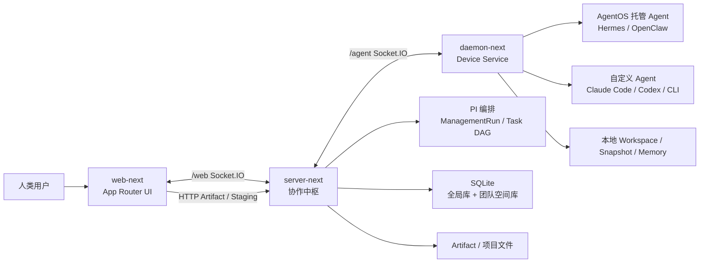

# AgentBean 产品介绍

AgentBean 是一个面向人类与 Agent 协作的**本地优先团队平台**。人类成员、本机 Agent、远程设备上的 Agent，可以在同一个 Team 里通过频道、私聊、任务、文件和记忆一起工作。

当前唯一产品入口是 **AgentBean Next**：生产服务位于 [`https://api.agentbean.dev/`](https://api.agentbean.dev/)，由 `server-next` 托管 Web UI；设备端通过 npm 包 `@agentbean/daemon` 安装 Device Service。

---

## 1. 产品定位

### 一句话

把多个 Coding Agent 和托管 Agent 变成可协作的团队成员，而不是各自孤立的终端会话。

### 解决什么问题

今天的 Coding Agent（Claude Code、Codex、Hermes、OpenClaw 等）大多是单人、单机、单会话工具。真实工作却往往跨越多台设备、多个 Agent、多个交付物，并且需要人类审核。AgentBean 把这些执行器接到统一的协作平面上：

- 人与 Agent 共享同一个 Team、频道和任务。
- 项目目录、完整运行日志和本地记忆默认留在用户设备上。
- Server 持有权限、任务真相、交付审核与可共享投影。
- 内置编排者只负责任务分解与调度，不代替外部 Agent 写业务代码。

### 给谁用

- 希望在一个界面里调用多种 Coding Agent 的个人开发者。
- 需要人类与多个 Agent 在频道、任务和文件上协作的小团队。
- 要把本机自定义 Agent 与 OpenClaw / Hermes 等托管 Agent 统一管理的用户。
- 重视本地 Workspace、执行记录、产物边界和记忆权限的用户。

### 核心原则

| 原则 | 含义 |
| --- | --- |
| Team 是唯一边界 | 频道、消息、任务、文件、记忆、设备和 Agent 可见性都归属于 Team。 |
| 本地优先 | 项目目录、完整运行日志、设备侧 Workspace Memory 默认留在 Device。 |
| Server 是协作权威 | 认证、权限、任务状态、交付审核、编排事实由 Server 持有。 |
| Agent 是可协作成员 | Agent 可以被 @、私聊、认领任务、提交产物，而不是隐藏在后台脚本里。 |
| PI 只编排不执行 | 内置 PI Manager 理解请求、拆任务、选 Agent、汇总结果；用户领域工作仍由外部 Agent 完成。 |

### 两类产品 Agent

AgentBean 不自己做一个通用 Coding Agent。它把已有执行器变成团队能力：

1. **自定义 Agent**：绑定某台设备上的执行环境（Claude Code、Codex、Kimi CLI、Gemini CLI、PI CLI 等）和项目目录。
2. **AgentOS 托管型 Agent**：由 OpenClaw、Hermes 等 AgentOS / Gateway 托管，可作为团队成员响应频道或私聊。

内置 **PI Manager** 是系统协调者，不是 Team 成员，不出现在普通聊天成员列表里，也不直接读写用户项目文件。

---

## 2. 功能特点

### 2.1 人类与 Agent 同屏协作

- 频道聊天、Agent 私聊（DM）、消息讨论串。
- `@Agent` 提及后，消息会按权限和路由规则派发到目标 Agent。
- 图片 / 文件附件、搜索、收藏、置顶、编辑与删除。
- 消息可以提升为任务；Dispatch 支持单次或频道级取消。
- Inbox、未读、系统 attention 分开建模：读过不等于处理完，notice 只是可丢失的唤醒信号。

用户不必切换到某个 Agent 的终端窗口。在 Web 里发消息、开讨论串、审任务，回复和产物会回到同一条协作时间线。

### 2.2 成员、能力与可见性

- 人类成员与 Agent 成员共存，角色为 owner / admin / member。
- Agent 可见性、配置更新、删除（tombstone，保留历史）。
- **Agent Exposure**：能力声明可草稿、发布、撤回；Team 可收紧操作限制。
- 自定义 Agent 的在线态同时看设备在线、执行环境可用、项目目录存在。
- 能力提取采用确定性扫描 + LLM 总结的混合路径，避免只靠模型口播。

### 2.3 设备常驻：Device Service

设备不是一次性 CLI 会话，而是后台服务：

- macOS 当前用户 LaunchAgent（无需 `sudo`）是当前 MVP。
- 同一用户的多个 Team Profile **共用一个** Device Service。
- 负责 Runtime 扫描、Agent 调用、Workspace Run、产物收集、可恢复发布、本地记忆。
- Web 中「添加设备」给出可复制的 `agentbean device connect` 命令；连接成功后终端退出，服务继续运行。

常用生命周期：`install` / `status` / `logs` / `restart` / `stop` / `start` / `uninstall` / `update`。卸载只删除服务本身，凭据、Workspace、Memory 会保留。

### 2.4 任务编排与跨 Agent 交付

复杂工作不是「再发一条聊天」。AgentBean 用结构化任务承载协作：

- 根任务由明确的 Promotion / orchestration trigger 创建，而不是每条消息自动建单。
- **Task DAG**：子任务可 offer / claim / release，失败有 bounded attempts 和有条件改派。
- Agent 先接受合同，再领取执行权；领取任务不等于自动获得所有高风险副作用权限。
- 根交付需要人类审（accept / reject）。
- Task delivery overview 聚合目标、acceptance、焦点动作与时间线。

这样，一个需求可以拆给 Codex 改代码、Hermes 写文档、另一个 Agent 做审查，人类只在关键门上做决定。

### 2.5 项目文件、产物与交付包

- **Channel Files / Documents**：服务端索引、Markdown 修订、发布与恢复。
- **Project Channel Workspace**：创建、导入、发布、物化、归档导出。
- **Workspace 暂存发布**（begin / put / get / commit）：大文件落盘暂存、断网续传、原子提交新 revision。
- **Output Package**：冻结成员、包级审核、设最终版，并与 Task 交付联动。
- Artifact 预览 / 下载、异步预览衍生；运行产物经 Device 受控路径收集后进入频道项目文件。

每次外部 Agent 执行形成一次 **Workspace Run**：命令、工作目录、exitCode、时长、脱敏日志摘要。生成文件不会绕过发布流程直接变成「团队真相」。

### 2.6 记忆与经验复用

记忆不是把聊天记录全塞进下一次 prompt，而是带权限、来源和治理的长期上下文：

- 协作记忆候选：接受 / 拒绝 / 合并。
- Formal Memory：授权用户可直接维护的形式记忆。
- Active Memory Context：协调时注入的最小活跃上下文，带来源归因。
- Agent Memory Projection：Agent owner 发布投影，Team opt-in 后才可被消费。
- Experience Pack：可复用经验包，从草稿到批准再到频道附着。
- 系统知识与用户个人记忆分作用域；设备侧本地 Workspace Memory 不替代 Server 权威记忆。

### 2.7 PI 管理与系统管理台

- Provider Cards：OpenAI 兼容 Chat Completions 预设；discover、生产路径测试、发布后激活。
- 系统级 active PI model 服务全部 Team。
- Token 用量按团队查询；可紧急停止 / 恢复自动协调。
- 系统管理员控制台覆盖 Team、User、Device、Agent、PI Provider 与记忆治理。

PI 只在结构化 trigger 成立后编排根任务。普通闲聊、关键词、单独 @Agent 都不会偷偷建单。

---

## 3. 技术架构

### 3.1 三进程协作平面



| 层 | 职责 | 明确不做的事 |
| --- | --- | --- |
| **Web**（`apps/web-next`） | 登录、Team 切换、频道 / DM / 任务 / 设备 / 设置 / 管理台；展示 Server snapshot 与事件 | 不推断权限、Agent 去重、Task 真相或跨 Agent 路由 |
| **Server**（`apps/server-next`） | 认证与 membership；消息 / 任务 / 项目 / 记忆权威；Dispatch 与 PI 编排；Artifact 授权 | 不在用户设备上执行 coding agent |
| **Device Service**（`apps/daemon-next`） | 设备连接、Runtime 扫描、Agent 调用、Workspace Run、产物发布、本地记忆 | 不承载 Promotion evaluator 或 PI Manager，也不成为跨 Team 的全局业务真相源 |
| **contracts + domain** | 跨端 DTO、事件名、错误码；纯领域规则 | 不含 Socket / SQLite / 文件系统 IO |

### 3.2 仓库结构

```text
AgentBean/
  packages/
    contracts/               共享 DTO、Ack<T>、Socket 事件、错误码
    domain/                  纯领域策略：路由、生命周期、记忆、任务 DAG、权限
    pi-management-runtime/   PI 模型适配、tool catalog、SEA 烟雾入口
  apps/
    server-next/             生产协作中枢（裸 node:http + Socket.IO + SQLite + 托管 web-next）
    web-next/                Next.js App Router 产品 UI（client-only）
    daemon-next/             Device Service / CLI（npm @agentbean/daemon）
  docs/adr/                  系统级架构决策
  docs/agents/               agent 协作约定、合并门禁、领域文档
  .trellis/                  项目级 agent harness：spec、task、journal
```

共享边界很硬：server / web / daemon 只依赖契约，互不反向依赖。领域规则可以在没有 Socket 和数据库的情况下测试。

### 3.3 数据隔离

- **全局库**：用户、Team、设备、Agent 配置、系统级 PI Provider。
- **团队空间库**：消息、频道、任务、Artifact、项目协作状态、协作记忆。
- 所有仓储和用例显式携带 `teamId`，不能靠隐式当前 Team。
- Web 路由以 `[teamPath]` 为作用域；Artifact HTTP 只接受 `/api/teams/:teamId/...`。

### 3.4 传输与权威写入

Server 使用裸 `node:http`，业务面主要走 Socket.IO，而不是大面积 REST：

| 命名空间 | 调用方 |
| --- | --- |
| `/web` | 浏览器 |
| `/agent` | Device Service |
| `/server-worker` | Server-hosted PI worker |

HTTP 只保留健康检查、指标、Artifact / Workspace staging 等必要面。

所有权威写入走封闭的 **Command registry**：

- 具名 command、exact-key schema、幂等 key、authority 由 Server 推导。
- 客户端不能通用 patch、自报角色，也不能绕过 registry 直接写库。
- 结果分类固定：`applied` / `no_op` / `replayed` / `freshness_hold` / `conflict` / `rejected` / `temporarily_unavailable` / `outcome_unknown`。
- notice 与 websocket 只负责唤醒；Query 才是权威读取。读候选签发与已读确认分离，打开页面不等于已读。

高风险外部副作用还需要单独的 **Invocation authorization** 和人类 **Action approval**。领取任务本身不自动批准发布、付款或不可逆操作。

### 3.5 Device 如何调用外部 Agent

Device Service 把「团队里的一次 dispatch」翻译成具体 runtime 调用：

- Codex 走 PTY，并强制非交互 / 最高权限，避免卡在审批 TUI。
- Claude Code、Hermes、OpenClaw 走 pipe / argv oneshot。
- 没有非交互入口的 Agent 不能进入异步 dispatch，否则会在后台挂死。
- 产物收集有路径穿越校验、运行窗口、敏感路径拒绝；大文件走 staging 原子发布。

自定义 Agent 的派发门禁是：绑定设备在线 → 执行环境可用 → 项目目录存在 → 只向该设备投递。AgentOS 托管型 Agent 走对应 socket / CLI dispatch。

### 3.6 PI 编排权威

只有结构化 **PI orchestration trigger** 才能创建根任务。每个根任务对应一份 Server-owned 的 orchestration run：

- Server 持久化 DAG、调度、deadline、event、audit 与 outbox。
- PI Manager 是可替换、带 fencing 的临时驱动。
- Device 只执行子任务和派生唤醒，不能接管根任务编排事实。
- Worker、Server 或设备重启后，靠持久事实和幂等 reconciliation 恢复，而不是靠某个进程的内存。

一句话：**PI 负责内部管理推理，Server 负责可靠协作，外部 Agent 负责用户具体任务。**

### 3.7 运行与发布

- Node **24.x**。
- 生产：根目录 Railway 部署 `server-next`，同一进程托管 `web-next`。
- 设备端：CI 依次发布 `@agentbean/contracts` → `@agentbean/pi-management-runtime` → `@agentbean/daemon-next`，再发布 canonical `@agentbean/daemon@latest`。
- 用户设备目标平台当前为 **macOS**（含 Intel x64）；Linux / Windows 系统服务不在 MVP 内。

---

## 4. 开发流程（Harness）

AgentBean 既是多 Agent 协作产品，也用一套明确的 **agent harness** 来开发自己。这里的 harness 指：给 AI 编程代理提供稳定入口、持久上下文、验证门禁和发布证据，而不是靠一次聊天记住所有约定。

### 4.1 默认交付循环

默认是**直接单人执行**，不为小改动强制套完整方法论流水线。

1. **对齐当前真相**：读仓库、相关 GitHub Issue / PR、以及 `CONTEXT-MAP.md` 指向的领域章节和 ADR。
2. **选最轻的入口**：事实清楚就直接改；只有需要持久产品合同时才 `to-spec`；只有需要可领取切片时才 `to-tickets`。
3. **隔离实现**：每个并行任务使用独立 git worktree，避免多个 agent 共用主工作区互相切分支。
4. **验证后合入**：针对性测试 + 对应 `build:*`（vitest 不做完整 `tsc`），中文 PR，Codex Review，合并门禁，再核对 `main` CI / 生产证据。
5. **保守清理**：只删除已合并且干净的 worktree 与分支。

仓库级最高权威是 `AGENTS.md`。外部 skill 是本地方法，不能替代 Server 权威、Trellis 任务状态、仓库验证、GitHub 门禁或生产证据。

### 4.2 Trellis：项目级 Agent Harness

[Trellis](https://github.com/mindfold-ai/Trellis) 是可选的上下文、记忆与 Execution Packet 层，版本由 `.trellis/.version` 锁定。它帮助跨 Session、跨 Coding Agent 或大型多阶段工作恢复上下文，但不建立第二套开发流水线。

| 部件 | 作用 |
| --- | --- |
| `.trellis/spec/` | 按包 / 层注入的实战编码指南，写代码前读取，而不是靠模型回忆 |
| `.trellis/tasks/` | 每个任务一个目录：PRD、可选 design / implement、research、check 记录 |
| `.trellis/workspace/` | 开发者 journal，跨会话跟踪 |
| `.trellis/workflow.md` | 只定义 Trellis 如何提供上下文；开发流程仍由 `AGENTS.md` 决定 |

使用约定：

- 普通、清晰、边界明确的任务直接执行，不创建 Trellis task。
- 只有跨 Session、跨 Coding Agent 或大型多阶段工作才创建 Execution Packet。
- `planning` / `in_progress` 只描述上下文包状态，不额外授权实现，也不自动触发子代理。
- 测试、Review、commit、PR、merge 与生产收口始终由 `AGENTS.md` 和 GitHub 远端事实决定。
- task archive、journal 和 spec 更新都是按需 bookkeeping，不是完成门禁。

### 4.3 跨 Harness 的技能路由

同一套仓库规则要同时服务 Codex、Claude Code、Grok 等不同编程代理。AgentBean 用「仓库权威 + 按需技能」而不是强制全链路：

| 来源 | 角色 |
| --- | --- |
| AgentBean 原生规则 | 中文 GitHub、worktree、Local Verification、PR 合并门禁、领域术语 |
| Trellis skills | 按需提供 Execution Packet、跨 Session 记忆与持久协作；不接管默认开发流程 |
| Matt Pocock skills | 按需工程方法：`tdd`、`diagnosing-bugs`、`codebase-design` 等，不是默认流水线 |
| 专项 skill | 例如可观测性，只在明确改 logging / metrics / tracing 时调用 |

原则：一次只让一个编排器拥有决策权。不为每个任务串联 Superpowers → Trellis → Matt → 专项清单。外部 skill 不得自行授权 commit、merge、deploy 或把本地观察冒充生产事实。

### 4.4 Worktree、Issue 与 GitHub 门禁

多个 agent 并行时禁止共用主 worktree。主目录留给 review / 合并 / 维护 `main`；功能分支在 `.worktrees/<分支名>` 中开发。Git 的「分支已被某 worktree 占用」会阻止串台。

Issue 与 PRD 在 GitHub。`ready-for-agent` 表示任务完整到可以自治实现。同一 GitHub 账号下的多个 Session 必须通过 **Session Claim** 认领，避免抢同一张票。

PR 流程刻意节制往返：

1. 先以 Draft 创建，让 CI 在 Review 前收敛。
2. `npm run check:pr-review-readiness` 通过后再标 Ready，触发 Codex Review。
3. 修完 finding 后跑 `npm run check:pr-merge-readiness`，确认最新 head 的 CI、Review 和线程都收敛。
4. GitHub 标题、描述、评论由仓库 agent 用中文撰写。

自动 Review 对 Draft 只做摘要；Ready 后按 P0/P1 阻塞、P2 可选收敛。文档-only 路径可豁免「必须覆盖最新 head」的 Codex Review。

### 4.5 验证 Harness：从单测到生产

开发时的「证明做完了」分层，而不是只靠模型口头声称：

| 层级 | 证明什么 |
| --- | --- |
| 包测试 | contracts / domain / pi-management-runtime / server-next / daemon-next / web-next 的 vitest |
| `tsc` build | 严格类型；vitest 经 esbuild 转译，**不能**代替 `build:server-next` 等 |
| DOM / preview harness | 无浏览器时覆盖关键交互：登录恢复、发消息、artifact、task、thread |
| Phase 边界检查 | PI、Task DAG、Memory 等跨包不变量，防止切片回退 |
| Browser smoke | 真实 Chrome 走登录、custom agent、dispatch、产物、任务、讨论串 |
| Production smoke | `main` 部署后的入口、健康检查与业务烟雾 |

对应命令见根 `package.json`：`test:ci`、`build:packages`、`smoke:agentbean-next-browser`、`check:agentbean-next-readiness`、`audit:agentbean-next-cutover`。

AgentBean Next 本身也曾用「切片 + 验证矩阵」从协议链路演进到生产切换：每个用户可见行为先有回归 harness，再删除旧行为。当前新增能力仍按垂直切片交付，而不是一次重写整层。

### 4.6 CI/CD

GitHub Actions 在 PR / push `main` 时按变更面决定校验、浏览器 smoke、npm 发布和 Railway 部署。

`main` 通过后的顺序：

1. 发布 npm 包（contracts → pi-management-runtime → daemon-next → canonical daemon）。
2. 从仓库根目录部署 Railway `server-next`。
3. 跑 production smoke。

设备端版本必须 bump `apps/daemon-next/package.json`，否则 CI 会因「版本已发布」跳过发版，用户 `agentbean update` 仍停在旧包。回滚只回到 schema 兼容的上一成功部署，以及经过 server-next smoke 验证的 daemon 版本；不得从 `main` 重建已删除的旧 `apps/*`。

---

## 5. 当前产品形态小结

AgentBean 的产品主张可以收成三句话：

1. **对人**：一个 Team 界面里完成聊天、任务、文件审核和设备管理，不必把工作拆散到多个 Agent 终端。
2. **对 Agent**：本机和远程设备上的执行器成为有身份、有权限、可认领任务、可交付产物的成员。
3. **对系统**：Server 守住权威与恢复，Device 守住本地执行，PI 只在明确授权后编排，开发过程本身也用同样的 harness / 证据纪律来约束 AI 代理。

本地体验入口：

```bash
npm install
npm run dev:agentbean-next:open
```

默认 Web preview 为 `http://localhost:4100/`。设备接入（macOS）：

```bash
npm install -g @agentbean/daemon@latest && agentbean device connect \
  --invite-code '<code>' \
  --server-url '<url>' \
  --profile-id '<profile>'
```

更细的协议、ADR 与验证矩阵见：

- 产品合同：`docs/superpowers/specs/2026-05-09-agentbean-prd.md`
- 领域地图：`CONTEXT-MAP.md`
- 目标架构：`agentbean-next/docs/target-architecture.md`
- 架构决策：`docs/adr/`
- 开发契约：`AGENTS.md`、`.trellis/workflow.md`、`docs/agents/pr-merge-gate.md`
