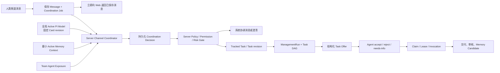

# AgentBean PI Agent MVP 重整实施计划

> 状态：实施基线，待编码
> 日期：2026-07-19
> 决策来源：根目录 `CONTEXT.md` 与 `docs/adr/0001`—`0049`
> 历史设计：`docs/superpowers/specs/2026-07-10-agentbean-pi-management-agent-design.md`

## 1. 结论

当前 AgentBean 已经完成了 PI Runtime Adapter、ManagementRun、Task DAG、Claim/Lease、Agent Invocation、Memory Capsule/Candidate 和 Server Worker 协议等大量技术地基，但尚未形成用户真正需要的 PI Agent 产品闭环。

主要原因不是缺少 PI SDK，而是现有入口和治理模型仍沿用早期 Phase 设计：消息先经过确定性路由和关键词建 Task；Team 需要选择 `direct/shadow/managed`、Device/Server placement、模型和预算；Agent 的扫描 Skill 被直接当成 Capability；Task Offer 到达 Device 后自动认领；Memory 则以技术治理面板独立暴露。这些行为与现已确认的产品模型冲突。

本轮不推倒已经可用的协作内核。MVP 采用以下重整方式：

1. 保留现有 ManagementRun、Task DAG、Invocation、Lease、Memory 来源与审计能力。
2. 新增 Server-hosted Channel Coordinator，先保存消息，再异步形成持久化协调决策。
3. 用全系统唯一 Active PI Model 取代 Team 模型、Runtime Profile 和 MVP placement 选择。
4. 用 Team-scoped Agent Exposure Manifest 取代 PI 对 Agent 内部 Skill inventory 的直接消费。
5. 用一个 Team 开关“PI 自动协调”取代 Team 的多模式、多 Phase、多预算表单。
6. 把 Memory 产品面收进 PI Management，并补齐频道归档和 Reusable Experience Pack。

## 2. MVP 必须交付的用户结果

MVP 上线后必须同时满足以下结果，否则只能算技术预备，不能算 PI Agent 已集成：

- 每条人类频道消息都会被 Server 侧 PI 理解，但只有满足门槛时才创建 Task 或 ManagementRun。
- 显式 `@Agent` 是硬目标约束；PI 可以澄清或报告不可用，不能静默改派。
- PI 可以判断聊天、澄清、单 Agent 请求、Tracked task、Task follow-up 和需要分解的任务。
- PI 只能根据当前 Team 的 Agent Exposure Manifest 匹配公开 Capability 与 Skill。
- Agent 明确接受仍有效的 Task Offer 后，系统才创建 Claim/Lease。
- 系统管理员可以在独立 PI Agent 设置页配置、测试、发布 Provider Card，并选择一个全局 Active PI Model。
- Team 不知道 Provider、Model、Endpoint、Credential 或切换历史，只看到 PI 正常、降级或不可用。
- Team Owner/Admin 只维护一个默认开启的“PI 自动协调”开关。
- PI Memory Center 能治理 Team、Channel、Team-scoped Agent Memory、Candidate 和 Experience Pack。
- 频道归档代表项目结束：确认取消全部非终态工作、冻结 Channel Memory，并允许整理可复用经验。
- Active PI Model 不可用时，消息仍能成功保存和展示；自动建 Task、分解、Offer 和 Memory 写入停止，不静默切换模型。

## 3. 明确不进入 MVP

- PI Runtime Profile、Team 自选 Provider/Model、Team Credential。
- 多模型路由、模型池、隐式 fallback、按职责绑定不同模型。
- 费用、人民币单价、账单、预算、Token 配额；只记录 Provider 返回的 Token Usage。
- Device-only PI coordination；MVP 只有 Server-hosted Channel Coordinator。
- Anthropic Messages、OpenAI Responses、Gemini、Bedrock、OAuth、任意 Header/Body、Shell 或环境变量插值。
- Windows/Linux 用户 Device 支持；用户 Device 只承诺原生 `darwin-arm64` 与 `darwin-x64`。
- PI 安装、复制、启停、更新或探测 Agent 内部 Skill。
- 跨 Team 业务记忆、自学习 AgentBean 全局业务记忆、知识图谱和复杂自动冲突合并。
- 多个 Team 自动化开关、Team Phase 选择或 Team placement 选择。

## 4. 当前能力差距矩阵

| 能力 | 当前实现 | MVP 目标 | 处理方式 |
|---|---|---|---|
| 频道消息入口 | `sendMessage()` 先执行 `routeMessageForChannel()`，再用关键词判断是否建 Task，并可能立即 Dispatch | 消息先持久化；每条人类频道消息进入 Channel Coordinator；PI 决定是否产生后续动作 | 新增持久化 Coordination Job/Decision；旧路由只保留兼容与未迁移路径 |
| Task 创建门槛 | `asTask` 或关键词正则 | PI 根据持续跟踪、交付、风险、权限和意图清晰度判断；显式“作为任务”仍是硬指令 | 固定结构化 Coordination Decision，Server 侧 policy gate 执行动作 |
| Team PI 策略 | `direct/shadow/managed`、Phase、placement、Device、Provider、Model、budget | 只有默认开启的“PI 自动协调” | 新建 `team_pi_policies`；旧 policy 只供旧 Run 恢复，不再作为产品设置 |
| PI 模型供给 | Device 环境变量提供 test-only Credential；Server Worker 只校验 credential ref | 系统管理员维护 Provider Card revision，测试发布后选择全局 Active PI Model | 新建全局 Provider Supply、加密 Secret Store 和生产同路径 Adapter |
| Server Coordinator | 已有 Server Worker Pool/Scheduler 协议，但没有产品化 Worker 运行时与后台模型配置 | Server-hosted Coordinator 不依赖用户 Device 在线 | MVP 在 Server 部署边界内运行独立队列消费者；复用 PI runtime 与 Management Tools |
| Provider 协议 | Daemon 中硬编码 OpenAI Chat Completions，缺少 timeout、模型发现、配置修订和真实测试 | OpenAI-compatible Chat Completions；四个 preset；模型发现/手填；文本与 tool-call 测试 | 把 Adapter 下沉到共享 runtime，Server Provider Supply 与生产调用复用同一路径 |
| PI 设置 IA | PI policy 嵌在 Team 设置；Memory 是独立技术 Tab | PI Agent 与“团队”并列，拥有独立详情页；系统与 Team scope 分开 | 新建 `/[teamPath]/settings/pi`；全局 admin 与 Team owner/admin 看到不同内容 |
| Agent 能力来源 | `AgentDto.skills` 来自 Daemon 扫描，含内部 `sourcePath`；Claim 把 Skill name 当 Capability | PI 只看 Team-scoped Exposure Manifest；Capability、required Skill、preferred Skill 分离 | 新建 Agent Exposure 合同与存储；从 PI 消费路径移除 `AgentDto.skills` |
| Agent 自治 | Device 收到 Offer 后 `canAcceptOffer: () => true` 并立即 acquire | Agent 返回 accept/reject/needs-info/counter-proposal；accept 后才 Claim | 扩展 Offer 状态机和协议；保留既有原子 Claim/Lease 实现 |
| 候选排序 | 可见、在线、频道权限和“Skill name 伪 Capability”硬过滤 | Capability/required Skill 硬过滤；preferred Skill 与 Team-local reliability 排序 | 重写 candidate resolver，保留在线、权限、依赖与循环守卫 |
| Task Skill | `TaskCoordinationDto` 只有 `requiredCapabilities` | 增加 `requiredSkills`、`preferredSkills` 和 manifest revision fence | 扩展合同、migration、DAG/Offer/诊断视图 |
| 多 Agent 覆盖 | Task DAG 内核存在，但没有按 Capability/Skill 校验父子覆盖 | 根 Task 可由多个子任务共同覆盖；每个可执行子任务必须由单 Agent 完整覆盖 | 新增纯 Domain coverage evaluator，并在发布 Offer 前 fail closed |
| Task follow-up | 主要依赖 thread、最近 Agent 和旧 Task assignee 路由 | 强绑定直接进入 Task；模糊关联需建议或确认；重大变更产生 Task revision | 新增 Task link evidence 与 revision，不覆盖旧目标、认领和交付历史 |
| Memory 类型 | `semantic/episodic/procedural/preference/decision/artifact-summary` | 产品只显示 `fact/decision/rule/preference`；经验独立为 Pack | 增加 Formal Memory 产品投影；复用底层来源、状态、审计，不在 MVP 强制重写历史表 |
| Memory 权限 | 多数 Team 成员可直接写 team/channel/agent scope；公开 Agent Memory 可被普通成员读取 | Team/Channel Formal Memory 由 Team Owner/Admin 管理；频道成员可纠错；Agent owner 管公开投影，Team owner/admin 决定使用 | 收紧 Server permission adapter；读取与写入权限分别测试 |
| Memory UI | 独立 Tab 暴露 grant、capsule、invocation、raw scope ID 等技术概念 | PI Memory Center 展示正式记忆、候选、来源和经验；Capsule 只在诊断详情出现 | 复用数据和治理服务，重做产品 DTO 与页面层级 |
| 频道归档 | 只写 `archivedAt` | 归档前统计并确认取消全部非终态工作；归档后停止执行、冻结 Channel Memory | 新增 Channel Archive Gate 与同 Team DB 事务编排 |
| 跨频道经验 | 无 Experience Pack | 来源频道归档时批准生成；目标频道再次批准关联；不自动复制 | 新建 Pack、source snapshot 与 channel attachment 模型 |
| 降级行为 | managed preflight 失败可能使发消息返回失败，或走旧 direct fallback | 消息永远先保存；PI 失败只影响自动协调；不跨模型 fallback | 新增 PI runtime status 与用户可见状态事件，删除新路径的 direct fallback |
| 系统身份 | Message 支持 `senderKind=system`，但无明确 PI coordination message 类型 | PI 使用 AgentBean 系统协调身份，紧凑展示澄清、状态与汇总 | 增加 system message subtype 和来源/贡献引用，不创建 PI Team 成员 |

## 5. 目标运行链路

关键边界：模型只提出结构化协调意图；所有 Message、Task、Offer、Claim、Memory 与归档副作用都由 Server 再次校验并持久化。模型响应本身不具备执行权。

## 6. 最小数据与合同变化

### 6.1 全局 PI Provider Supply

放在 Global DB，仅系统管理员可读写：

- `pi_provider_cards`：Card 身份、显示名称、preset、备注、控制台链接、当前 draft/published revision。
- `pi_provider_card_revisions`：不可变配置 revision，包含 protocol、base URL、endpoint mode、model ID、timeout、max output tokens 和受限兼容参数。
- `pi_provider_credentials`：只保存经 AES-256-GCM 加密的 Bearer API Key、key version 和 credential fingerprint；任何 DTO、日志和审计都不得返回密文或明文。
- `pi_provider_revision_tests`：文本测试、完整 tool-call 回合、响应 model、finish reason、usage、耗时、诊断码与测试时间，不保存业务消息。
- `pi_active_model`：单例绑定已发布且测试通过的 Card revision + Model ID，记录操作者和启用时间。
- `pi_runtime_state`：`normal/degraded/unavailable`、最后成功/失败时间、公开诊断码；公开 DTO 不包含 Provider/Model 身份。

Server 使用部署环境中的 `AGENTBEAN_PI_SECRET_KEY` 解密 Credential。Key 缺失或解密失败时只把 PI 标记为 unavailable，不能阻止 Server 启动或消息保存。MVP 不接 KMS，不允许 API Key 回显。

### 6.2 Team PI Policy 与协调事实

放在 Team DB：

- `team_pi_policies`：`team_id`、`auto_coordination_enabled`、`updated_by`、`updated_at`。
- `channel_coordination_jobs`：Message 对应的 durable job、状态、attempt、可重试时间和 pinned Active PI Model revision。
- `channel_coordination_decisions`：结构化意图、风险、置信度、硬目标、Task link evidence、所需 Capability/Skill、执行状态和诊断。

消息与 Job 必须在同一 Team DB 事务内提交。模型调用和后续副作用在事务外异步执行，通过 message ID/idempotency key 保证重放不重复建 Task 或发 Offer。

### 6.3 Coordination Decision

MVP 固定意图：

- `no_action`
- `system_reply`
- `clarification_required`
- `agent_request`
- `tracked_task`
- `task_followup`

Decision 必须包含可审计的短理由码，而不是完整思维链。`agent_request/tracked_task/task_followup` 还必须包含结构化目标、交付物、风险等级、显式目标约束、required Capabilities、required Skills 和 preferred Skills。Server 对 schema、权限、Team 开关、频道状态、明确 mention 与风险重新校验。

### 6.4 Agent Exposure 与 Task Offer

- `agent_exposure_manifests`：按 `team_id + agent_id + revision` 保存公开 Capabilities、Skills、约束、状态、有效期和发布者。
- `team_agent_exposure_restrictions`：Team Owner/Admin 只能禁用已暴露 operation，不能新增 Capability/Skill。
- `task_coordination` 增加 `required_skills_json`、`preferred_skills_json`。
- `task_offers` 持久化 objective、deliverables、constraints、risk、task revision、manifest revision、状态与回复。

现有 `agents.skills_json` 保留为 Adapter/Agent owner 的报告来源，不再直接进入 PI context、候选匹配或普通 Team API；尤其不得把 `sourcePath` 传给 PI。Adapter 可以把报告转成公开 Manifest，但这是 Agent 侧发布，不是 PI 扫描或核验内部实现。

### 6.5 Formal Memory 与 Experience Pack

MVP 复用现有 Memory item/source/status/audit/Candidate/Capsule 表，不先做破坏性重建：

- 新增产品 DTO `FormalMemoryKind = fact | decision | rule | preference`。
- 存储适配层暂将 `fact -> semantic`、`rule -> procedural`；`decision/preference` 原样保存。
- 历史 `episodic/artifact-summary` 不进入 Formal Memory 新建入口或默认 Active Context，只作为 legacy 记录等待人工整理。
- 新增 `experience_packs`、`experience_pack_sources` 和 `channel_experience_attachments`；Pack 不是单条 Memory。
- System Knowledge 与 User Memory 属于 Global DB；Team/Channel/Agent Memory 与 Pack 属于 Team DB。

Memory conflict 只在相同 scope 内处理：管理者选择“新项取代旧项”或“二者并存”；PI 不自动合并或确定优先级。

## 7. 五个实施切片

### 切片 A：全局模型到频道理解的首条真实链路

目标：系统管理员配置一个真实模型后，每条频道消息都能被 Server PI 异步理解；即使模型失败，消息也不失败。

交付：

1. Provider Card、revision、加密 Credential、模型发现、生产同路径测试、Active PI Model 与 runtime state。
2. 把 `management-model-adapter.ts` 的 OpenAI Chat Completions 能力下沉到共享 runtime，补齐 timeout、abort、`max_tokens`、受限兼容参数和可诊断错误。
3. 新建独立 PI Agent 设置页：系统管理员可管理 Provider/Active Model；Team 用户绝不收到这些字段。
4. 新建 Coordination Job/Decision；`sendMessage()` 改为先原子保存 Message + Job，再立即返回。
5. Coordinator 首期只允许 `no_action/system_reply/clarification_required` 三种无业务副作用决定，以 shadow 方式验证理解质量。
6. Web 显示 PI 正常/降级/不可用和紧凑系统协调消息，不显示模型身份。

验收：

- Provider Card 未测试可保存 draft，但不能发布或设为 Active。
- 文本测试或 tool-call 回合任一失败都不能发布 revision。
- API Key 不出现在 socket DTO、日志、测试结果、错误和浏览器状态中。
- 模型超时、401、429、5xx、非法 JSON、非法 tool call 时消息仍已保存。
- 一个 Message 重放只产生一个 Coordination Decision。
- Team Owner/Admin 与普通成员的 Web/Socket 响应都不含 provider/model/base URL。

### 切片 B：Task 门槛、显式目标与 Team 自动协调

目标：PI 可以把消息转成正确的聊天、澄清、单 Agent 请求、Tracked task 或 Task follow-up，并遵守一个 Team 开关。

交付：

1. 增加完整 Coordination Decision schema 和 Server policy gate。
2. Team PI 页面只有“PI 自动协调”开关，默认开启，Team Owner/Admin 可改。
3. 删除新路径对关键词正则、channel default agent 和旧 management mode 的依赖。
4. 单一显式 `@Agent` 固化为 hard target；目标不可用或公开能力不满足时向用户澄清，不静默改派。
5. 明确“作为任务”继续作为硬指令；普通消息由 Task creation gate 判断。
6. Task-linked message 使用强绑定证据；目标/范围/验收重大变化创建 Task revision 并使受影响的旧 Offer 失效。
7. 低风险且 Team 自动协调开启时可自动建 Task；高风险、不可逆或作用域扩大始终等待确认。

验收：

- 问候、讨论和系统问答不建 Task。
- 需要持续跟踪、明确交付或异步等待的请求能建 Tracked task。
- Team 开关关闭时仍产生理解决定，但除明确 `@Agent`/“作为任务”外只建议、不自动行动。
- 修改已执行 Task 不覆盖旧 revision、Claim、Invocation 和交付记录。

### 切片 C：Agent Exposure、Skill 匹配和显式接受

目标：PI 只能根据 Agent 的当前公开契约发 Offer，Agent 接受后才 Claim。

交付：

1. Agent owner 在 Agent 页面管理各 Team 的 Capability、Skill、约束和可用状态；Team Owner/Admin 只能限制使用。
2. PI Team 页面只读展示 coverage、缺口、匹配理由和 Team-local reliability，不提供内部 Skill 管理。
3. `TaskCoordinationDto`、Domain evaluator、candidate resolver 和 DAG 视图分离 Capability、required Skill、preferred Skill 与 experience。
4. Task Offer 增加目标、交付、约束、risk、required Capability/Skill、Task revision、manifest revision 和 TTL。
5. Agent 协议明确返回 `accepted/rejected/needs_info/counter_proposed`；只有 accepted 才调用现有 acquire 创建 Claim/Lease。
6. Manifest 更新使未接受的旧 Offer 失效；已接受 Task 不因 Manifest 变化自动取消，安全权限撤销除外。
7. 根 Task 允许子任务联合覆盖；每个发布执行的子任务必须由一个 Agent 完整覆盖全部硬要求。

验收：

- PI context 和候选诊断中不存在未公开 Skill、`sourcePath` 或其他 Team 的 Manifest。
- 缺 required Capability/Skill 的 Agent 不能进入开放 Offer；preferred Skill 只改变排序。
- 用户硬指定 Agent 但其必要 Skill 未声明时，系统保留目标并请求确认。
- Offer ACK 不再等于 Claim；Agent 拒绝或请求补充信息时没有 Lease。
- Team-local reliability 只能排序，不能给 Agent 补出未声明 Skill。

### 切片 D：PI Memory Center 与最小 Active Context

目标：把现有 Memory 技术能力收敛成可用产品，并让 PI 的理解、拆分和选 Agent 可解释地使用记忆。

交付：

1. PI Team scope 下提供 Formal Memory、Candidate、Agent Memory projection 和 Experience Pack 页面；Capsule/Invocation 进入诊断详情。
2. System Knowledge 只在系统 scope；User Memory 只在个人设置。
3. Formal Memory 固定四种类型和最小字段，授权者可直接创建、修订、停用或 supersede。
4. 收紧读取/写入权限；频道成员可查看本频道 Memory 和提交纠错，但不能直接修改正式记录。
5. inferred 内容只进入 Candidate；明确指令在原 scope 内可直接生效并提供撤销；扩大 scope 始终确认。
6. Coordinator 和 ManagementRun 只装载当前 Task/Channel 相关的最小 Active Memory Context，并记录实际使用的 Memory ID/来源解释。
7. 同 scope 冲突只提供“取代旧项/同时保留”两种人工选择。

验收：

- PI 不因 Team Membership 读取私有频道、DM、其他用户或其他 Team 的 Memory。
- Agent Memory 始终按 `Team + Agent` 隔离；PI 看不到 Agent 内部 Session 或本地 Memory。
- 用户能看到实际影响决策且自己有权查看的 Memory 来源；解释不会泄露不可见来源。
- 未批准 Candidate 不进入 Active Context。

### 切片 E：频道归档、经验传递与上线收口

目标：频道所代表项目结束时完整收尾，并让经过两次确认的经验进入下一个频道。

交付：

1. Archive preflight 返回该频道非终态 Task、Invocation、Claim/Lease、Offer 和待审核交付数量。
2. 用户明确确认后，在 Team DB 事务边界内取消/失效全部非终态工作，再写 `archivedAt`。
3. 归档频道拒绝新 Message、Task、Offer、Invocation 和 Memory 写入；原 Channel Memory 只读且不再进入活跃频道上下文。
4. 归档时建议整理 Experience Pack；来源审批冻结 source snapshot、适用条件、结论和限制。
5. 目标频道再次确认 attachment 后，Pack 才进入该频道 Active Memory Context；不复制、不跨 Team。
6. 关闭旧 ManagementPolicy 产品入口，保留旧表和旧 Run 恢复读取；新 Team 默认开启 PI 自动协调。
7. 系统 Rollout 从 shadow 经验收切到 enforced；出现事故可由系统管理员紧急停用，但 Team 不看到 rollout 技术模式。

验收：

- 未确认取消时归档不发生任何部分写入。
- 归档完成后没有后台 Invocation、Claim 或 Offer 继续运行。
- 已批准的 Team Memory 和 Experience Pack 不因来源频道归档失效。
- 未经来源确认或目标频道确认，经验不会跨频道生效。
- 全局 Active PI Model 故障时不启用旧 direct route 或其他模型 fallback。

## 8. 主要文件落点

建议新增或改造的模块边界：

- `packages/contracts/src/pi-provider.ts`：Provider Card、revision、test、Active Model、公开 health DTO。
- `packages/contracts/src/pi-coordination.ts`：Coordination Job/Decision 与 system coordination message。
- `packages/contracts/src/agent-exposure.ts`：Manifest、Capability/Skill、restriction、Offer response。
- `packages/contracts/src/formal-memory.ts`：产品 Memory 与 Experience Pack DTO。
- `packages/domain/src/pi-coordination-policy.ts`：Team 开关、风险、显式目标和副作用 gate。
- `packages/domain/src/agent-eligibility.ts`：Capability/Skill/coverage/reliability 规则。
- `packages/pi-management-runtime/src/openai-chat-completions-adapter.ts`：生产与测试共用模型路径。
- `apps/server-next/src/application/pi/`：Provider Supply、Coordinator、Job worker、Agent Exposure、Archive Gate。
- `apps/server-next/src/infra/sqlite/migrations/global/0017_*`：Provider Supply、System Knowledge、User Memory。
- `apps/server-next/src/infra/sqlite/migrations/team/0025_*` 起：Team policy、coordination、Exposure/Offer、Experience Pack。
- `apps/web-next/app/[teamPath]/settings/pi/`：独立 PI Agent 设置页。
- `apps/web-next/components/pi-*`：Provider、health、Team automation、coverage、Memory Center。
- `apps/daemon-next/src/`：只负责 Agent/Adapter 发布 Manifest 和响应 Offer，不承载 MVP Channel Coordinator。

实现时不要直接删除现有 `management-router.ts`、Worker scheduler、Task DAG 或 Phase 3 Memory 服务。先让新 Channel Coordinator 不再依赖旧 Team policy；待新链路完整验证后，再把旧代码降为兼容层。

## 9. 验证策略

每个 TypeScript 切片除目标 Vitest 外，必须执行仓库要求的对应 build：

- `packages/contracts`：`npm run build:contracts`
- `packages/domain`：`npm run build:domain`
- `apps/server-next`：`npm run build:server-next`
- `apps/daemon-next`：`npm run build:daemon-next`
- `apps/web-next`：`npm run build:web-next`

MVP 最终端到端矩阵至少覆盖：

1. 普通聊天被理解但不建 Task。
2. 显式 `@Agent` 形成定向 Offer，拒绝后不 Claim、不静默改派。
3. required Skill 过滤与 preferred Skill 排序正确。
4. 多能力根 Task 被拆成可由单 Agent 完整覆盖的子任务。
5. Team 自动协调关闭时只建议，明确指令仍可执行。
6. 模型不可用时消息保存成功，自动动作和 Memory 写入停止。
7. Team 角色的所有 API/DOM 都看不到 Provider/Model/Credential。
8. Memory scope、Candidate、来源解释和 Agent Memory Team 隔离。
9. 频道归档取消全部非终态工作并冻结 Channel Memory。
10. Experience Pack 未完成两次确认时不能在目标频道生效。
11. 新协调链路重启恢复与幂等重放不重复创建 Task、Offer、Claim 或系统消息。
12. Device 执行回归在原生 `darwin-arm64` 与 `darwin-x64` 发布验证中均通过。

## 10. 第一编码切片建议

先实施“切片 A：全局模型到频道理解的首条真实链路”，但把提交拆成三个可独立验证的小步：

1. 共享 OpenAI-compatible Adapter + Provider Supply contracts/domain/storage。
2. 系统管理员 Provider Card/测试/Active Model API 与独立 PI 设置页。
3. Message + Coordination Job 原子写入、Server consumer、三种无副作用 Decision 和降级状态。

这一切片会最早证明三件最重要的事：系统管理员真的能配置可用模型；频道消息真的由 PI 理解；模型故障不会破坏聊天。通过后再开放自动建 Task、Offer 和 Memory 副作用，能把回归风险控制在最小范围。
