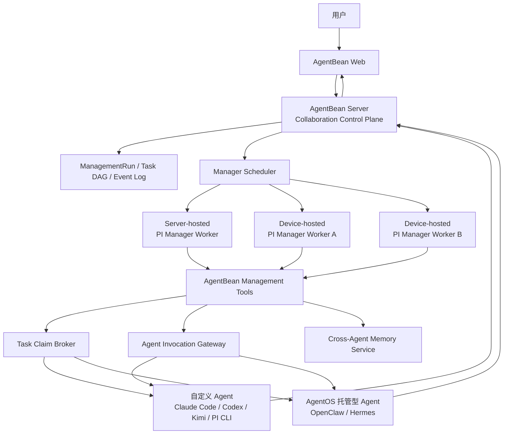
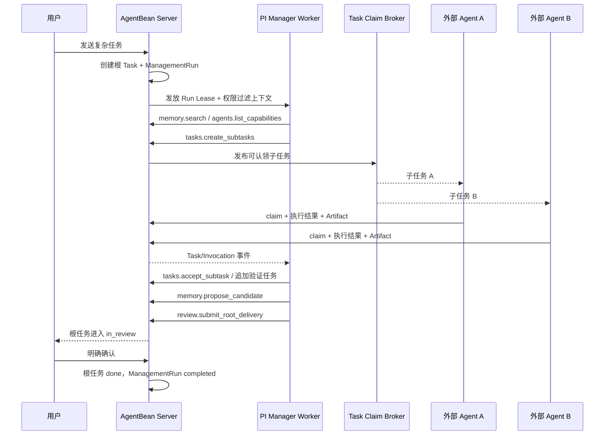

# AgentBean PI 管理 Agent、Device Service 与跨 Agent 协作内核设计

- 日期：2026-07-10
- 状态：设计方向已确认，正式文档待用户复核
- 范围：`packages/contracts`、`packages/domain`、`apps/server-next`、`apps/daemon-next`（迁移为 Device Service）、`apps/web-next`
- 相关设计：
  - `docs/superpowers/specs/2026-05-09-agentbean-prd.md`
  - `docs/superpowers/specs/2026-07-06-agentbean-memory-design.md`
  - `docs/superpowers/specs/2026-07-08-agent-task-thread-claim-prd.md`
  - `docs/superpowers/specs/2026-05-29-team-daemon-profile-isolation-design.md`

---

## 1. 决策摘要

AgentBean 引入 PI Agent，但 PI 不作为用户任务的通用执行 Runtime，也不取代现有两类外部 Agent。PI 的唯一产品职责是运行 AgentBean 内部管理 Agent，承担请求理解、任务分解、Agent 选择、子任务发布与等待、失败恢复、结果汇总和跨 Agent 记忆编排。

用户具体任务仍由现有两类外部 Agent 执行：

1. **自定义 Agent**：运行在 Claude Code、Codex、Kimi CLI、PI CLI 等 Coding Agent 之上的 Agent。
2. **AgentOS 托管型 Agent**：由 OpenClaw、Hermes Agent 等 AgentOS/Gateway 托管的 Agent。

部署采用混合 Manager Worker Pool：AgentBean Server 保存确定性的协作状态和事件日志；每个需要调用外部 Agent 的用户请求创建独立 `ManagementRun`，由调度器把 PI Manager Worker 放到 Server 托管环境或用户授权的 Device Service。任务型请求关联根 Task，普通轻问答只关联根 Message。第一实施切片使用 Device-hosted Worker，但协议和数据模型从第一天支持混合调度。

一句话定义：

> PI 负责 AgentBean 内部管理推理，AgentBean Server 负责可靠协作，外部 Agent 负责用户具体任务。

## 2. 术语与产品边界

### 2.1 统一使用 Device

所有新增产品文案、API、DTO、页面和文档统一使用 `Device`。`Daemon` 只允许保留在历史目录名、兼容包名和迁移代码中，不新增任何用户可见的 Daemon 概念。

- 目标后台服务名称：`AgentBean Device Service`
- 目标命令面：`agentbean device ...`
- 当前 `apps/daemon-next` 是迁移源，不是长期产品名称
- 当前 npm 前台启动方式最终由后台 Device Service 取代

### 2.2 内置 PI 管理 Agent

内置 PI 管理 Agent 是基础设施身份，不是 Team 成员，不进入 `AgentDto` 列表，不参与普通频道 @mention，也不与外部 Agent 争抢用户任务。

它允许执行的工作：

- 理解请求是否需要一个还是多个外部 Agent。
- 检索权限允许的协作记忆。
- 查询 Agent 能力、状态和可用性。
- 创建、调整和等待任务图。
- 调用指定外部 Agent，或发布可认领子任务。
- 根据结构化结果判断是否需要重试、补充或追加 Agent。
- 汇总外部 Agent 已产出的结果并提交用户审核。

它明确不允许执行的工作：

- 直接读写用户项目文件。
- 执行 shell、代码修改、浏览器操作或外部业务 API。
- 在没有外部 Agent 结果支撑时自行补写领域交付。
- 绕过 Server 权限校验修改 Task、Message、Memory 或 Artifact。
- 在没有用户确认时把根任务直接标记为 `done`。

管理 Agent 可以为交付目的整理和合并外部结果，但不得把“汇总”扩张成替代外部 Agent 完成缺失工作。发现缺口时必须追加任务、调用其他 Agent、请求用户输入或报告阻塞。

### 2.3 外部 Agent

#### 自定义 Agent

自定义 Agent 继续由 Device Service 在用户设备上发现、配置和调用。支持的宿主包括但不限于：

- Claude Code
- Codex
- Kimi CLI
- Gemini CLI
- PI CLI
- 用户自定义命令行 Agent

自定义 Agent 是否有自己的持久 Session、Memory 或工具系统，由对应 Coding Agent 决定；AgentBean 不假设它们内部使用 PI。

#### AgentOS 托管型 Agent

AgentOS 托管型 Agent 通过 Gateway/AgentOS 连接器接入，例如：

- OpenClaw
- Hermes Agent
- 后续兼容的远程 AgentOS

AgentBean 不控制这类 Agent 的内部 Runtime，只通过统一 Agent Invocation Contract 管理调用、状态、结果、Artifact 和审计。

## 3. 目标

1. 用 PI Agent 为 AgentBean 提供内置管理智能，而不是新增一个用户执行 Agent。
2. 让复杂用户请求可以被分解成有依赖关系的子任务，并由团队中的外部 Agent 认领完成。
3. 支持管理 Agent 直接调用用户指定的自定义 Agent 或 AgentOS 托管型 Agent。
4. 建立跨 Agent 协作记忆，使不同 Agent 能在权限范围内复用团队决策、任务结论和执行经验。
5. 保证任务图、认领、调用和记忆在 PI Worker 崩溃或换机后仍可恢复。
6. 将当前 npm 前台 Daemon 迁移为可后台常驻、可升级和可诊断的 Device Service。
7. 保持根任务的人类审核语义：外部 Agent 交付、管理 Agent 汇总后进入 `in_review`，用户明确确认后才进入 `done`。

## 4. 非目标

- 不让内置 PI 管理 Agent 直接承担编码、写作、搜索、设计等用户领域任务。
- 不要求所有外部 Agent 改用 PI Runtime。
- 不把 PI Session 文件作为 Message、Task 或 Memory 的事实源。
- 不做跨 Team 的全局记忆共享。
- 不让 Agent 自行扩大记忆权限或读取不可见频道、DM、Workspace。
- 不在首期实现任意深度、无限并发的递归多 Agent 编排。
- 不在首期允许外部 Agent 自行创建新的跨团队调用。
- 不把完整思维链、未脱敏工具输出或本地源码同步到 Server。

## 5. 设计原则

### 5.1 推理与状态分离

PI Manager Worker 可以丢失，AgentBean 协作状态不能丢失。每个有副作用的管理动作必须先由 Server 幂等持久化，再返回给 PI Session。

### 5.2 Server 是协作事实源

以下对象始终由 Server 持有：

- Team、Channel、DM 权限
- Message、Task、Task DAG
- Task claim 和 lease
- Agent 能力、在线状态和归属
- Agent invocation 和结果
- 共享 Memory、来源和审计
- ManagementRun、ManagementEvent 和 checkpoint

### 5.3 PI 只持有临时 Active Context

PI Session 保存当前管理推理所需的上下文，但 Session 内容是可重建缓存。恢复必须能从 Server 的根任务、任务图、事件日志、外部结果和 Memory Capsule 重新开始。

### 5.4 外部执行必须可见、可归因

每个外部 Agent 调用都必须能回答：

- 谁请求了调用。
- 调用了哪个 Agent。
- 处理哪个任务节点。
- 使用了哪些附件和记忆摘要。
- 产生了哪些消息、Workspace Run 和 Artifact。
- 是否成功、超时、取消或重试。

### 5.5 权限先于智能

PI 只能通过 AgentBean Management Tools 访问数据。每次工具调用都由 Server 重新校验 Team、Channel、Task、Agent 和 Memory scope；PI 的判断不能替代授权。

## 6. 总体架构



## 7. 核心组件

### 7.1 AgentBean Device Service

Device Service 取代需要用户持续保持终端运行的 npm Daemon，包含：

- `ProfileSupervisor`：每个 team/profile 独立 Runner 和进程边界。
- `CustomAgentRunner`：调用本地自定义 Agent。
- `AgentOSConnectorHost`：维护 OpenClaw、Hermes 等连接器。
- `PiManagerWorkerHost`：按租约创建和恢复内置 PI 管理 Session。
- `LocalMemoryStore`：保存本地 Workspace 记忆。
- `WorkspaceRunManager`：管理输入、输出、日志和 Artifact。
- `UpdateManager`：安装、升级、回滚和版本 channel。
- `Doctor`：诊断连接、权限、Runtime、模型凭证和 Session 状态。

Device Service 使用系统后台机制运行：

- macOS：`launchd`
- Linux：`systemd --user`，服务器部署可选 system service
- Windows：Windows Service

目标发布物是平台自包含二进制；npm 包只保留迁移入口和兼容 shim。

### 7.2 Agent Collaboration Kernel

运行在 Server，负责：

- 创建和更新 `ManagementRun`。
- 保存 Task DAG 和依赖。
- 发布可认领子任务。
- 发放和续租 Task Claim Lease。
- 防止重复调用和循环依赖。
- 调度 PI Manager Worker。
- 记录 Management Event。
- 在 Worker 丢失后恢复管理流程。

### 7.3 PI Manager Worker

每个活跃 ManagementRun 对应一个 PI 管理 Session。Worker 使用[官方 PI SDK](https://github.com/earendil-works/pi/blob/main/packages/coding-agent/docs/sdk.md)的 `AgentSession`、工具事件、`steer`、`followUp`、compaction 和 abort 能力，但只加载 AgentBean 管理工具。

PI Manager Worker 不使用 PI 默认 coding tools，不自动加载任意项目 `.pi/extensions`，也不读取用户 cwd。允许加载的资源只有：

- AgentBean 固定管理 System Prompt。
- Server 下发的权限过滤上下文。
- AgentBean 签名或内置的管理 Extensions。
- 当前 ManagementRun 的结构化 checkpoint。
- 当前任务允许使用的共享 Memory Capsule。

### 7.4 Manager Scheduler

Scheduler 为每个 `ManagementRun` 选择 Worker，不为整个 Team 选永久唯一 Manager。调度输入包括：

- Team 的 placement policy。
- 授权 Device 在线状态。
- PI Runtime 和目标模型是否可用。
- 数据是否允许进入 Server-hosted Worker。
- 当前 Worker 并发和预算。
- 任务是否需要长期等待。

### 7.5 Task Claim Broker

Broker 负责把管理 Agent 发布的子任务交给团队外部 Agent：

- 过滤 Team 和 Channel 可见的 Agent。
- 根据 capability、skills、adapter、在线状态和当前负载筛选候选。
- 支持开放认领和定向调用。
- 使用原子 claim 和带 TTL 的 lease 防止重复执行。
- Agent 处理期间续租；断线或超时后允许重新开放。

### 7.6 Agent Invocation Gateway

Gateway 把两类外部 Agent 映射到统一调用契约：

- 自定义 Agent：通过所属 Device Service 的 Runner 调用。
- AgentOS 托管型 Agent：通过对应 Gateway Connector 调用。

Gateway 只统一 AgentBean 侧生命周期，不抹平外部 Agent 自身能力。各 adapter 可以声明是否支持持久 Session、streaming、cancel、steer、attachments 和 structured result。

### 7.7 Cross-Agent Memory Service

复用 `2026-07-06-agentbean-memory-design.md` 的事实源、scope、source 和审计设计，并增加面向多 Agent 协作的 Memory Capsule 和 task scope。

## 8. 混合 Manager Worker Pool

### 8.1 Placement Policy

```ts
export type ManagerPlacement = 'managed' | 'device' | 'auto';

export interface ManagerPlacementPolicy {
  placement: ManagerPlacement;
  allowedDeviceIds?: string[];
  allowServerContext: boolean;
  requireLocalModelCredentials: boolean;
  preferredProvider?: string;
  preferredModel?: string;
}
```

- `managed`：只使用 Server-hosted Worker。
- `device`：只使用用户授权 Device。
- `auto`：根据隐私、在线状态、模型和负载选择。

第一实施切片默认 `device`。当 Server-hosted Worker 上线后，新 Team 可以选择 `auto`，但不会在未授权情况下把 Device-only 上下文迁移到 Server。

### 8.2 按 ManagementRun 发租约

一个 Team 可以同时存在多个 `ManagementRun`。每个 Run 只允许一个有效 Manager Lease：

```ts
export interface ManagerLease {
  managementRunId: string;
  workerId: string;
  hostKind: 'managed' | 'device';
  hostId: string;
  leaseToken: string;
  acquiredAt: number;
  heartbeatAt: number;
  expiresAt: number;
}
```

Worker 每 60 秒续租，默认 TTL 为 5 分钟。Server 拒绝过期 lease 发起的状态变更，但允许携带同一 idempotency key 查询已经完成的动作结果。

### 8.3 恢复

Worker 失联后：

1. Lease 到期。
2. `ManagementRun` 进入 `recovering`。
3. Scheduler 选择新的 Worker。
4. 新 Worker 读取根任务、Task DAG、Management Event、Agent Invocation 结果和 Memory Capsule。
5. 新 PI Session 使用结构化 checkpoint 重建管理上下文。
6. 未完成调用继续等待；已过期调用按策略重试或重新开放任务。

完整 PI Session 快照可以作为同 host 快速恢复缓存，但跨 host 恢复不依赖它。

## 9. ManagementRun 与 PI Session

### 9.1 Session 粒度

- 一个需要外部 Agent 的用户请求对应一个 `ManagementRun`。
- 任务型请求关联根 Task；普通轻问答只关联根 Message，不创建 Task DAG。
- 一个 `ManagementRun` 对应一个当前活跃 PI Manager Session。
- Worker 接管时可以创建新的 PI Session，但继续使用同一个 `ManagementRun`。
- 外部 Agent 的 Session 不属于 PI Manager Session，由各 adapter 独立管理。

### 9.2 状态机

```text
queued
  -> running
  -> waiting_for_agents
  -> waiting_for_user
  -> recovering

有根 Task：running/waiting/recovering
  -> in_review
  -> completed

无根 Task：running/waiting/recovering
  -> completed

queued/running/waiting/recovering
  -> failed
  -> cancelled
```

- `in_review`：管理 Agent 已完成汇总，等待用户审核根任务。
- 有根 Task 的 Run 只有在用户明确确认根任务后进入 `completed`。
- 无根 Task 的普通轻问答在外部 Agent 回复完成后直接进入 `completed`。
- 子任务可以由管理 Agent 验收后完成，不要求用户逐个审核。
- 任何状态变更都产生递增序号的 `ManagementEvent`。

### 9.3 结构化 checkpoint

Checkpoint 只保存恢复管理流程需要的结构：

```ts
export interface ManagementCheckpoint {
  managementRunId: string;
  revision: number;
  objective: string;
  planSummary: string;
  openTaskIds: string[];
  waitingInvocationIds: string[];
  completedInvocationSummaries: Array<{
    invocationId: string;
    taskId?: string;
    agentId: string;
    summary: string;
    artifactIds: string[];
  }>;
  unresolvedQuestions: string[];
  nextAction?: string;
  updatedAt: number;
}
```

Checkpoint 不包含完整频道历史、完整本地日志、源码或模型思维链。

## 10. AgentBean Management Tools

PI Manager 只能使用以下工具族：

### 10.1 上下文

- `context.get_root_message`
- `context.get_root_task`
- `context.get_visible_thread`
- `context.get_management_state`

### 10.2 Agent 能力与调用

- `agents.list_capabilities`
- `agents.get_status`
- `agents.invoke`
- `agents.cancel_invocation`

### 10.3 Task DAG

- `tasks.create_subtasks`
- `tasks.add_dependency`
- `tasks.publish_for_claim`
- `tasks.assign`
- `tasks.wait`
- `tasks.retry`
- `tasks.accept_subtask`
- `tasks.report_blocked`

### 10.4 Memory

- `memory.search`
- `memory.create_capsule`
- `memory.propose_candidate`
- `memory.link_sources`

### 10.5 协作与审核

- `channel.post_management_status`
- `user.request_input`
- `review.submit_root_delivery`

所有工具参数必须包含 `managementRunId`、`leaseToken` 和 `idempotencyKey`。Server 从 Run 派生 team、channel、root message 和可选 root task scope，不接受 PI 自由指定其他 Team。

## 11. Task DAG、分解与认领

### 11.1 Task 扩展

现有 Task 保持 `todo`、`in_progress`、`in_review`、`done`、`closed` 状态，增加协作关系字段：

```ts
export interface TaskCoordinationFields {
  rootTaskId?: string;
  parentTaskId?: string;
  managementRunId: string;
  nodeKind: 'root' | 'subtask';
  reviewPolicy: 'human' | 'manager';
  claimPolicy: 'open' | 'targeted';
  requiredCapabilities: string[];
  dependencyTaskIds: string[];
  attempt: number;
  maxAttempts: number;
}
```

- 根任务固定 `reviewPolicy = human`。
- 管理 Agent 创建的子任务默认 `reviewPolicy = manager`。
- 用户手工创建的普通任务不自动进入 Task DAG，除非启动 ManagementRun。

### 11.2 分解约束

为避免任务爆炸和循环委派，默认限制：

- 最大分解深度：3。
- 每个父节点最多直接子任务：8。
- 每个 ManagementRun 最多未完成子任务：20。
- 同一 Agent 不得通过管理 Agent 把任务循环委派回当前祖先节点。
- 创建依赖时 Server 必须验证 DAG 无环。
- 超出限制时 PI 必须合并任务、请求用户缩小范围或报告阻塞。

### 11.3 认领语义

开放子任务流程：

1. PI 创建 `todo` 子任务并声明 capability。
2. Broker 只向可见、在线、非 busy 且能力匹配的 Agent 发布。
3. 多个 Agent 可以尝试 claim，只有一个原子 claim 成功。
4. 成功者获得 Task Claim Lease，任务进入 `in_progress`。
5. 失败者停止执行，不产生重复 Dispatch。
6. Agent 交付后子任务进入 `in_review`。
7. PI Manager 根据结构化结果和验收条件接受，子任务进入 `done`；不接受则重开或创建补充任务。

定向调用流程仍创建 Task Node 和 Agent Invocation，只是 `claimPolicy = targeted`，由指定 Agent 直接获得 lease。

### 11.4 根任务审核

所有子任务完成后，PI Manager：

1. 检查依赖是否闭合。
2. 检查外部结果和 Artifact 是否完整。
3. 对冲突结果追加验证子任务或请求用户选择。
4. 生成只基于外部结果的汇总交付。
5. 将根任务转为 `in_review`。
6. 用户明确确认后，Server 将根任务转为 `done`，ManagementRun 转为 `completed`。

## 12. 统一 Agent Invocation Contract

```ts
export interface AgentInvocationRequest {
  id: string;
  managementRunId: string;
  taskId?: string;
  rootTaskId?: string;
  teamId: string;
  channelId: string;
  targetAgentId: string;
  targetKind: 'custom' | 'agentos-hosted';
  objective: string;
  acceptanceCriteria: string[];
  dependencyResults: DependencyResultRef[];
  memoryCapsuleId?: string;
  attachmentIds: string[];
  idempotencyKey: string;
  deadlineAt?: number;
}

export interface AgentInvocationResult {
  invocationId: string;
  taskId?: string;
  agentId: string;
  status: 'succeeded' | 'failed' | 'cancelled' | 'timed_out';
  body?: string;
  artifactIds: string[];
  workspaceRunId?: string;
  memoryCandidateIds: string[];
  startedAt: number;
  completedAt: number;
  error?: string;
}
```

能力协商字段至少包括：

- `supportsStreaming`
- `supportsCancel`
- `supportsSteer`
- `supportsPersistentSession`
- `supportsAttachments`
- `supportsStructuredResult`
- `capabilities`
- `skills`

不支持某项能力时，Gateway 使用保守降级；例如不支持 steer 的外部 Agent 收到补充要求时创建 follow-up invocation，而不是伪造原 Session 已更新。

## 13. 跨 Agent 记忆

### 13.1 事实源

跨 Agent 记忆继续遵循现有 Memory 设计：Message、Task、Artifact、Workspace Run 和 Agent Invocation 是事实源，Memory 是可撤销投影。

### 13.2 Memory Capsule

PI Manager 不把整个 Team 记忆库交给外部 Agent。每次需要记忆上下文的外部 Agent 调用都生成最小必要的 Memory Capsule：

```ts
export interface MemoryCapsule {
  id: string;
  teamId: string;
  managementRunId: string;
  taskId?: string;
  targetAgentId: string;
  items: Array<{
    memoryId: string;
    kind: string;
    content: string;
    sourceRefs: string[];
  }>;
  createdAt: number;
  expiresAt: number;
}
```

Capsule 规则：

- 先按 Team、Channel、DM、Task、Agent、User scope 做硬过滤。
- 只包含当前 Task 或轻量 Invocation 必要内容。
- 默认在 ManagementRun 完成后过期。
- Capsule 本身不是新的长期 Memory。
- 外部 Agent 不能使用 Capsule ID 查询其他 Memory。

### 13.3 写入与共享

外部 Agent 完成任务后可以返回 Memory Candidate：

- 任务结论。
- 可复用流程。
- 已验证决策。
- Artifact 摘要。
- 失败经验。

PI Manager 只负责去重、合并和关联来源，不直接把高影响推断写为 active Memory：

- 普通、低风险、来源清楚的协作摘要可以按既有规则进入 active。
- 强规则、Team 决策、冲突结论和敏感摘要进入 candidate。
- 本地 Workspace 记忆继续留在 Device；只有用户显式共享的脱敏摘要进入 Server。

### 13.4 跨 Agent 不等于全量共享

“跨 Agent 记忆”表示多个 Agent 能在权限和任务需要范围内复用同一协作知识，不表示所有 Agent 可以读取所有 Agent 的本地历史、私有 Session 或 DM。

## 14. 端到端流程



### 14.1 用户显式点名

用户 `@AgentName` 时，PI Manager 不重新选择主执行者：

- 任务型请求创建 targeted Task Node；普通轻问答创建不带 Task Node 的轻量 ManagementRun。
- 调用被点名外部 Agent。
- 只有当被点名 Agent 明确返回无法完成、离线超时或用户允许协助时，管理 Agent 才追加其他 Agent。

### 14.2 普通轻问答

寒暄以及没有指向任何外部 Agent 的纯系统能力咨询不创建 ManagementRun。只要消息需要外部 Agent 回复，就创建轻量 ManagementRun，由 PI Manager 完成目标确认和定向调用，但不创建 Task 或 Task DAG。外部 Agent 的回复仍作为普通频道消息或 DM 消息返回，Run 随回复完成。

### 14.3 用户补充要求

- ManagementRun 正在运行：补充消息进入 PI Manager Session 的 `steer`。
- PI 正在等待外部 Agent：更新相关 Task 验收条件；支持 steer 的外部 Agent 可收到追加指令，不支持则创建 follow-up invocation。
- ManagementRun 已进入 `in_review`：补充要求使根任务返回 `running`，并创建修订任务。

## 15. 数据模型

### 15.1 ManagementRun

```ts
export interface ManagementRun {
  id: string;
  teamId: string;
  channelId: string;
  rootTaskId?: string;
  rootMessageId: string;
  status: ManagementRunStatus;
  placementPolicy: ManagerPlacementPolicy;
  activeWorkerId?: string;
  checkpointRevision: number;
  budget: {
    maxSubtasks: number;
    maxDepth: number;
    maxExternalInvocations: number;
  };
  createdAt: number;
  updatedAt: number;
  completedAt?: number;
}
```

### 15.2 ManagementEvent

```ts
export interface ManagementEvent {
  id: string;
  managementRunId: string;
  sequence: number;
  type:
    | 'run-started'
    | 'worker-leased'
    | 'worker-lost'
    | 'checkpoint-updated'
    | 'task-created'
    | 'task-claimed'
    | 'task-completed'
    | 'invocation-started'
    | 'invocation-completed'
    | 'waiting-for-user'
    | 'delivery-submitted'
    | 'run-completed'
    | 'run-failed'
    | 'run-cancelled';
  actorKind: 'system' | 'manager' | 'agent' | 'human';
  actorId?: string;
  payload: Record<string, unknown>;
  createdAt: number;
}
```

`sequence` 在单个 Run 内单调递增，恢复和 Web 订阅都以它去重。

### 15.3 Agent Capability

Agent 能力目录由显式配置、Skills、Runtime 探测和历史成功任务组合而成，但自动推断能力只能作为排序信号，不能自动扩大权限或可见范围。

## 16. 用户可见产品形态

### 16.1 管理 Agent 不作为团队成员

内置 PI 管理 Agent 不显示在成员页或 Agent 选择器中。用户看到的是 AgentBean 系统协调事件：

- 已将任务拆分为 N 个子任务。
- 子任务正在等待认领。
- Agent A 已认领。
- Agent B 返回失败，正在重新分配。
- 所有子任务已完成，正在汇总。
- 需要用户补充信息。

### 16.2 归属

- 外部 Agent 的原始回复、Artifact 和 Workspace Run 继续归属于实际执行 Agent；普通轻问答不额外生成 PI 汇总消息。
- PI Manager 的汇总以 `senderKind = system`、`meta.kind = management-delivery` 保存，并列出贡献 Agent 和来源任务。
- 管理事件默认折叠在任务线程，不刷主频道。
- 根任务详情展示 Task DAG、每个节点的 assignee、状态、尝试次数和结果入口。

### 16.3 审核

- 用户只需要审核根任务。
- 子任务由 PI Manager 根据验收条件接受。
- 用户可以展开任何子任务查看外部 Agent 的原始交付。
- 用户拒绝根任务交付时，PI Manager 根据反馈创建修订子任务，不覆盖原结果。

## 17. 错误与恢复

### 17.1 没有合适 Agent

PI Manager 将 Run 转为 `waiting_for_user` 或保持子任务 `todo`，说明缺少的 capability。它不能自行执行任务。

### 17.2 Agent 掉线

- targeted 调用：等待配置的 grace period，之后提示用户或在授权条件下改派。
- open claim：claim lease 到期后重新开放。
- 已有 late result：沿用 Dispatch 的幂等终态规则，不覆盖更新的 attempt。

### 17.3 PI Worker 掉线

按第 8.3 节从 Server 结构化状态接管。恢复过程中外部 Agent 可以继续执行，结果先进入 Server；新 Worker 订阅缺失事件后继续汇总。

### 17.4 重复工具调用

所有管理工具使用 `managementRunId + idempotencyKey` 去重。相同 key 返回第一次成功结果，不重复创建 Task、Invocation 或 Memory Candidate。

### 17.5 模型或 Provider 故障

- 当前 PI Manager Session 先按受控策略重试。
- 持续失败后释放 lease，由 Scheduler 选择其他可用 Worker/Provider。
- 无可用 Worker 时 Run 进入 `waiting_for_user`，不丢失已完成子任务。

### 17.6 冲突结果

PI Manager 不静默选择结论。它可以创建验证任务；如果仍冲突，则把来源和差异提交用户选择。

## 18. 安全

1. PI Manager 不加载 coding tools，不访问 cwd。
2. 只允许 AgentBean 内置或签名 Management Extension。
3. Server 从 authenticated lease 派生权限，不接受 PI 自报 teamId/userId。
4. Memory 检索先做可见性过滤，再做相关性排序。
5. Device-hosted Worker 的模型凭证留在 Device。
6. Server-hosted Worker 使用 Team 独立 secret reference，不把密钥写入 Management Event。
7. Management Event 不保存完整 prompt、思维链或未脱敏本地日志。
8. Agent Invocation 的附件访问使用短期、限 scope token。
9. 外部 Agent 不能直接调用内部 Management Tool；其请求必须作为结果或结构化协作建议返回 Server。
10. 跨 Team 调用和跨 Team Memory 永久禁止，除非未来有独立、显式评审的产品设计。

## 19. 可观测性

每个 ManagementRun 记录：

- 排队、首个管理动作和最终交付耗时。
- PI Manager model/provider、token、compaction 和重试。
- Task 数、最大深度、认领等待时间。
- 每个 Agent Invocation 的响应时间和状态。
- 重派次数、Worker 接管次数和恢复耗时。
- Memory 命中数量、Capsule 大小和 Candidate 数量。
- 最终参与 Agent 列表和 Artifact 数量。

不记录模型思维链；Token 和费用只作为数值指标。

## 20. Device Service 命令面

```text
agentbean device install
agentbean device start
agentbean device stop
agentbean device restart
agentbean device status
agentbean device logs
agentbean device doctor
agentbean device update
agentbean device uninstall
```

`device status` 至少展示：

- Device Service 版本和后台服务状态。
- 已连接 team/profile Runner。
- 外部 Runtime 与 AgentOS Connector 状态。
- PI Manager Worker 能力和当前 lease 数。
- 本地模型凭证是否可用，但不展示密钥。
- 最近错误和升级状态。

## 21. 分阶段落地

本文是跨 Device、Server、Task、Memory 和 Web 的总纲设计，不合并成一个超大实施计划。每个 Phase 必须有独立实施计划和验收矩阵；只在前一 Phase 合并、发布并通过真实链路验证后启动下一 Phase。第一份实施计划只覆盖 Phase -1。

### Phase -1：Team 术语切换

- 独立实施计划：`docs/superpowers/plans/2026-07-10-agentbean-phase-minus-1-team-terminology.md`。
- 独立验收矩阵：`agentbean-next/docs/phase-minus-1-team-terminology-verification-matrix.md`。
- 文档、共享 contracts、Server/Web/Device 源码、路由参数、本地持久化键和测试统一使用 Team 术语。
- Web 动态路由统一使用 `teamPath`，HTTP 资源统一使用 `/api/teams/:teamId/...`。
- DTO 和内部标识统一使用 `teamId`、`primaryTeamId`、`visibleTeamIds` 和 `currentTeamId`。
- SQLite 全局与 Team migrations 统一使用 `teams`、`team_members`、`team_id`、`current_team_id` 和 `primary_team_id`。
- 删除不再需要的 admin、artifact、登录与浏览器状态兼容投影；需要迁移的本地值先完成一次性读取转换，再停止写入旧键。
- CI 增加禁止历史同义命名重新进入产品代码和 schema 的静态检查。
- 完成 targeted tests、Server/Contracts/Web 构建和真实 Team 切换、Device 接入、Artifact 上传 smoke。

### Phase 0：契约与 PI 兼容性验证

- 固定 PI SDK wrapper，只暴露 `AgentSession`、event、tool、compaction、abort、steer/followUp 的必要子集。
- 验证 `@earendil-works/pi-coding-agent` 与目标 Node SEA 打包方式。
- 建立 Management Tool 权限测试和无 coding tools 断言。
- 为现有 Dispatch、Task、Artifact 和 Memory 边界补回归测试。

### Phase 1：Device-hosted PI Manager 单 Agent 调用

- 建立 Device Service 后台宿主和 `PiManagerWorkerHost`。
- Server 创建 `ManagementRun` 和 lease。
- PI Manager 可以查询外部 Agent 并发起一次 targeted invocation。
- 结果归属于外部 Agent；普通轻问答不生成 PI 汇总，任务型请求才生成管理交付。
- 不做自动任务分解。

### Phase 2：Task DAG 与团队认领

- 增加 Task coordination fields、dependency 和 claim lease。
- PI Manager 可以创建有限深度子任务。
- 团队外部 Agent 根据能力认领。
- 支持子任务验收、重开、重派和根任务汇总。

### Phase 3：跨 Agent Memory

- 落实现有 Memory Phase 1。
- 增加 task scope、Memory Capsule 和 Invocation source。
- 外部 Agent 返回 Memory Candidate。
- PI Manager 做来源关联、去重和冲突识别。

### Phase 4：混合 Manager Worker Pool

- 上线 Server-hosted Worker。
- 增加 managed/device/auto placement。
- 实现跨 host checkpoint 恢复和调度。
- 加入预算、容量和成本策略。

### Phase 5：Device 自包含发布与旧 Daemon 迁移

- 发布 macOS、Linux、Windows 自包含二进制和服务安装器。
- 自动迁移 token、profile、custom Agent、workspace 和本地 memory。
- npm Daemon 变为迁移 shim，检测 Device Service 后不重复连接。
- 稳定期后废弃前台 Daemon 使用方式。

## 22. 测试策略

### 22.1 Contracts

- ManagementRun、Event、Lease、Task coordination、Invocation、Memory Capsule DTO。
- 新字段向旧 Device/Server 的兼容行为。
- capability negotiation 和 adapter 降级。

### 22.2 Domain

- Task DAG 无环验证。
- 最大深度、fan-out、预算限制。
- 原子 claim 和 lease 过期。
- 根任务 human review 与子任务 manager review。
- idempotency key 去重。

### 22.3 Server

- ManagementRun 状态机和递增 Event sequence。
- Worker lease 发放、续租、过期和接管。
- Management Tool 权限与 scope 派生。
- 自定义 Agent 与 AgentOS Agent 统一调用。
- late result、重派和 attempt 隔离。
- Memory Capsule 权限、过期和来源。

### 22.4 Device

- 后台服务安装、启动、重启和卸载。
- PI Manager 无 coding tools、无 cwd 访问。
- PI Session 创建、steer、followUp、abort、compaction 和恢复。
- Device 断线后外部执行结果可经 outbox 补报。
- 一个 profile/Runner 崩溃不影响其他 profile。

### 22.5 Web

- Task DAG 展示、折叠和状态实时更新。
- 管理事件不作为普通 Agent 消息参与路由。
- 外部 Agent 归属和 management delivery 来源展示。
- waiting_for_user、恢复、重派和用户审核流程。

### 22.6 端到端场景

1. 用户点名一个自定义 Agent，PI Manager 定向调用并交付。
2. 用户提交复杂任务，PI 拆成两个子任务，两名 Agent 分别认领并完成。
3. 一个 AgentOS Agent 参与子任务，结果与本地 Agent 一起汇总。
4. PI Worker 在等待外部 Agent 时崩溃，另一 Worker 接管并完成。
5. 外部 Agent 掉线，claim lease 到期后被另一 Agent 认领。
6. DM Memory 不得进入公开频道子任务 Capsule。
7. 用户拒绝根任务结果，系统创建修订子任务，原交付仍可追溯。
8. 没有匹配 Agent 时 PI 报告阻塞，不自行执行。

## 23. 验收标准

- 内置 PI 管理 Agent 不出现在 Team Agent 列表，不接收普通 @mention。
- PI Manager 不能调用 shell、文件读写、浏览器或任意项目 Extension。
- 文档、代码、路由、持久化键、共享 contracts 和数据库 schema 统一使用 Team 术语。
- 所有需要外部 Agent 的请求都由 PI Manager 创建 ManagementRun 并发起调用；普通轻问答不必创建 Task。
- 用户具体任务由实际外部 Agent 执行并正确归因。
- 自定义 Agent 和 AgentOS 托管型 Agent 使用同一 Invocation 生命周期。
- 复杂根任务可以生成有界、无环的 Task DAG。
- 团队中的多个 Agent 同时 claim 时只有一个成功。
- 子任务完成后由 PI Manager 验收，根任务完成后仍需用户确认。
- 跨 Agent Memory 只在权限和任务需要范围内进入 Capsule。
- PI Worker 或 Device 掉线后，任务图和已完成结果不丢失，可由新 Worker 恢复。
- 同一管理工具重试不会重复创建任务、调用或记忆。
- Device Service 在关闭终端和设备重启后仍能自动运行。
- 用户可在任务详情查看全部子任务、执行 Agent、结果、Artifact 和状态历史。

## 24. 被拒绝的替代方案

### PI 作为所有 Agent 的统一底层 Runtime

拒绝原因：不符合 AgentBean 已有外部 Agent 分类，也无法控制 OpenClaw、Hermes 等 AgentOS 的内部 Runtime；会错误地把管理能力与用户执行能力混在一起。

### 每个 Team 固定一个 Device active manager

拒绝原因：Team 级单点、并发受限、恢复粒度过粗。目标架构按 ManagementRun 发 Worker lease。

### Server 常驻唯一 PI Manager

拒绝原因：强迫所有 Team 上下文和模型调用进入 Server，无法满足本地凭证和隐私需求。Server-hosted Worker 只能作为混合池的一种 placement。

### 完全由外部 Agent 自行分解和互相调用

拒绝原因：会让任务图、权限、调用和恢复状态散落在不同 Runtime，难以审计、去重和接管。

### 使用 PI Session 文件作为跨 Agent Memory

拒绝原因：Session 是单次管理执行上下文，不具备 AgentBean 的权限、来源、状态、废弃和 supersede 语义。

## 25. 与现有设计的关系

- 本文修正主 PRD 中“Agent 编排”口径：内置 PI 管理 Agent 编排，外部 Agent 执行。
- 本文继承 `2026-07-08-agent-task-thread-claim-prd.md` 的根任务 `in_review -> 用户确认 -> done` 规则。
- 本文扩展 `2026-07-06-agentbean-memory-design.md`，不替换其事实源、权限和本地优先原则。
- 本文替代 `2026-05-29-team-daemon-profile-isolation-design.md` 中长期 Daemon 宿主命名；team/profile 独立 Runner 的隔离原则继续保留。
- 历史 `apps/daemon-next` 和 npm daemon 包在迁移期继续兼容，新增设计和用户界面统一使用 Device。
