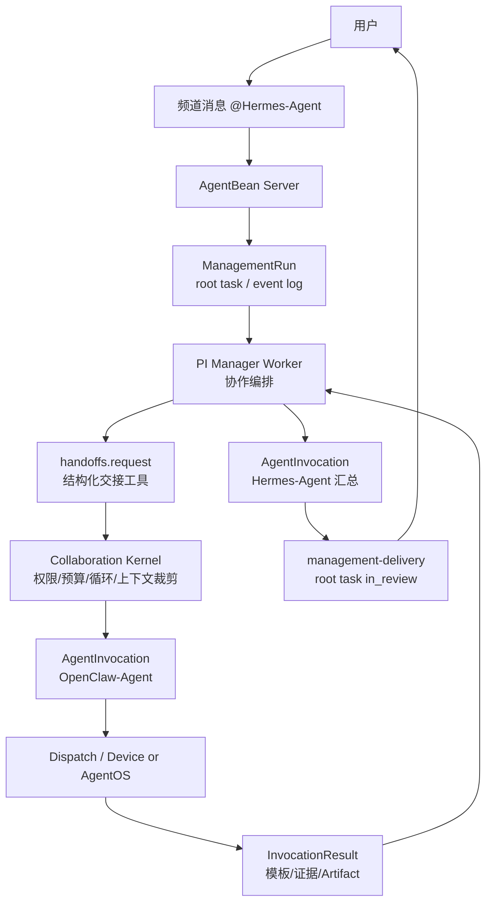

# AgentBean 多智能体协作与交接架构设计

- 日期：2026-07-13
- 状态：设计草案，待评审
- 范围：`packages/contracts`、`packages/domain`、`apps/server-next`、`apps/daemon-next`、`packages/pi-management-runtime`、`apps/web-next`
- 相关文档：
  - `docs/superpowers/specs/2026-07-10-agentbean-pi-management-agent-design.md`
  - `docs/superpowers/specs/2026-07-08-agent-task-thread-claim-prd.md`
  - `docs/superpowers/specs/2026-07-06-agentbean-memory-design.md`

---

## 1. 背景

用户希望在一个频道里放多个智能体，例如 `Hermes-Agent` 和 `OpenClaw-Agent`。人类可以在频道中 `@Hermes-Agent` 发起任务：

> 我今天主要完成小红书剪藏效果优化。你根据今天的工作内容，问问 @OpenClaw-Agent 日报模板是什么，根据日报模板梳理今天的日报。

理想行为不是简单让两个 Agent 在频道里互相刷消息，而是：

1. 用户点名 `Hermes-Agent`，系统确认这是一个需要外部 Agent 协作的任务。
2. `Hermes-Agent` 或内置管理 Agent 判断需要 `OpenClaw-Agent` 提供日报模板。
3. 系统把“向 OpenClaw 获取日报模板”记录为结构化子任务或结构化交接。
4. `OpenClaw-Agent` 在权限允许的频道上下文内执行，并把结果、证据和产物回传。
5. `Hermes-Agent` 或管理 Agent 基于 OpenClaw 结果继续完成日报汇总。
6. 最终交付进入同一个任务线程，贡献 Agent、交接原因、证据和状态都可追溯。

当前感觉“有卡点”的原因，是 AgentBean 已经有点名路由和 Phase 1 managed 单 Agent 链路，但还没有把“一个 Agent 需要另一个 Agent 继续干活”建模为可持久化、可恢复、可审计的协作事实。

本文档不是替代既有 PI 管理 Agent 设计，而是补齐它之后的下一层：从“可靠调用一个外部 Agent”推进到“在同一个 `ManagementRun` 内可靠调用多个 Agent，并保存结构化交接”。

## 2. 当前实现事实

### 2.1 已有点名路由，但它是单次 dispatch 路由

`packages/domain/src/routing.ts` 的 `routeMessage()` 解析消息开头的 `@name`，在在线、团队可见、频道成员等条件满足时返回单个 `{ kind: 'dispatch', agentId, reason: 'mention' }`。无 `@` 时选择第一个 eligible online Agent 作为 fallback。

这解决了“用户点名哪个 Agent 起手”问题，但没有表达：

- 当前任务是否需要多个 Agent。
- 第一位 Agent 是否可以把工作交给另一位 Agent。
- 交接内容、依赖结果、验收标准和证据是什么。
- 后续消息应该进入哪个运行、哪个任务节点、哪个当前 owner。

### 2.2 Phase 1 已有 managed 单 Agent 垂直链路

`apps/server-next/src/application/usecases.ts` 的 `sendMessage()` 已经在创建 direct dispatch 前调用 `managementRouter.route()`。当 Team policy 进入 managed 模式时，消息会进入 `ManagementRun`，而不是直接创建普通 dispatch。

`packages/contracts/src/management.ts` 已定义 `ManagementRunDto`、`ManagementRunStatus`、`ManagerPlacementPolicyDto` 和 `ManagementBudgetDto`。`packages/contracts/src/invocation.ts` 已定义 `AgentInvocationIntentV1`、`DependencyResultRefDto`、`AgentInvocationViewDto` 和 `AgentInvocationResultDto`。

`apps/server-next/src/application/management/management-tool-executor.ts` 已提供 Phase 1 管理工具：

- `context.get_root_message`
- `context.get_root_task`
- `context.get_visible_thread`
- `context.get_management_state`
- `agents.list_capabilities`
- `agents.get_status`
- `agents.invoke`
- `agents.cancel_invocation`
- `channel.post_management_status`
- `user.request_input`
- `review.submit_root_delivery`

其中 `agents.invoke` 当前只允许调用 `run.frozenTarget`，并传入 `allowedTargetAgentIds: [target.agentId]`。因此 Phase 1 的真实能力是“内置管理 Agent 围绕用户点名的单个外部 Agent 做可靠调用、等待和交付”，不是频道多 Agent 协作。

### 2.3 现有管理事件已经覆盖协作骨架，但缺少 handoff 语义

`packages/contracts/src/management-event.ts` 已有：

- `task-created`
- `task-claimed`
- `subtask-delivered`
- `task-acceptance-decided`
- `invocation-created`
- `dispatch-attempt-started`
- `dispatch-attempt-completed`
- `root-delivery-submitted`

这些事件足以支撑任务图、调用和交付，但还没有一个事件能明确表达：

- “Agent A 请求把一部分工作交给 Agent B”。
- “交接是顺序依赖、并行咨询，还是请求模板/事实/审核”。
- “Agent B 拿到的是完整线程、裁剪后的上下文、上游产物引用，还是 memory capsule”。
- “Agent B 的结果应该回到 Agent A、管理 Agent、频道，还是直接交给用户”。

### 2.4 当前卡点

系统现在同时存在两条模型：

1. **聊天路由模型**：频道消息通过 `@` 找到一个 Agent，然后创建 direct dispatch。
2. **管理运行模型**：`ManagementRun` 由 PI 管理 Agent 用工具调用外部 Agent。

多 Agent 交接不能只在聊天路由模型上叠加自然语言，因为那会导致：

- Server 不知道任务当前 owner。
- 重试、取消、超时和恢复无法归因到具体交接。
- 下游 Agent 看不到结构化输入，只能读一段人类风格上下文。
- 上游 Agent 的“给下一个 Agent 的信息”无法被权限过滤、摘要、裁剪和审计。
- 最终交付无法证明哪些结果来自哪个 Agent。

所以卡点不是 `@OpenClaw-Agent` 无法被识别，而是缺少“协作运行中的结构化交接协议”。

## 3. 外部架构参考

外部多 Agent 系统大致分为四类：

| 模式 | 代表 | 特点 | 对 AgentBean 的启发 |
|---|---|---|---|
| Manager / agents-as-tools | OpenAI Agents SDK、LangGraph supervisor | 中央管理者调用专家 Agent，管理者保留最终控制权 | 适合 AgentBean 当前 `ManagementRun`，因为 Server 要保留权限、审计、恢复和最终交付控制 |
| Handoff | OpenAI Agents SDK、LangChain handoffs | 一个 Agent 把控制权交给另一个 Agent，后者接管对话 | 适合“当前 owner”明确变化的交互，但必须把 active owner 持久化 |
| Swarm | AutoGen Swarm、LangGraph Swarm | Agent 通过 handoff message/tool 动态决定下一个 Agent，共享上下文 | 适合探索性协作，但容易循环和难审计，不能作为 AgentBean 第一版默认 |
| Group chat / selector | AutoGen、Semantic Kernel | 多 Agent 共享会话，由 selector 或 group manager 控制发言 | 适合头脑风暴，不适合当前以任务、证据、Artifact 为核心的产品主线 |

OpenAI Agents SDK 把多 Agent 设计归为两个常见模式：manager 把 Agent 当工具调用并保留会话控制权，或 handoff 让专家 Agent 接管会话。OpenAI 的 handoff 文档还强调 handoff 本质是 Agent 把任务委托给另一个 Agent。LangChain / LangGraph 的 handoffs 文档把 handoff 解释为工具更新持久状态变量，例如 `active_agent`，之后系统根据该状态改变行为。AutoGen Swarm 则通过 `HandoffMessage` 选择下一位 speaker，并让接收 Agent 在相同消息上下文中接管任务。Semantic Kernel 的 Agent Orchestration 文档把顺序、并发、handoff、group chat 等模式都作为不同协作模式处理。

参考链接：

- [OpenAI Agents SDK：Handoffs](https://openai.github.io/openai-agents-python/handoffs/)
- [OpenAI Agents SDK：Agents 与多 Agent 模式](https://openai.github.io/openai-agents-python/agents/)
- [LangChain：Handoffs](https://docs.langchain.com/oss/python/langchain/multi-agent/handoffs)
- [LangGraph Swarm](https://reference.langchain.com/python/langgraph-swarm)
- [AutoGen Swarm](https://microsoft.github.io/autogen/dev/user-guide/agentchat-user-guide/swarm.html)
- [AutoGen Core：Handoffs](https://microsoft.github.io/autogen/dev/user-guide/core-user-guide/design-patterns/handoffs.html)
- [Semantic Kernel：Agent Orchestration](https://learn.microsoft.com/en-us/semantic-kernel/frameworks/agent/agent-orchestration/)

结论：AgentBean 不应第一版采用完全去中心化 swarm。AgentBean 的产品事实源在 Server，已有 `ManagementRun`、Task、Dispatch、Artifact、Memory、Lease 和 Event，因此推荐采用“Server 事实源 + PI Manager 编排 + 结构化 handoff”的混合架构：Agent 可以提出交接，但交接由 Server 记录、校验、调度和恢复。

这里的“结构化 handoff”不是要求所有 Agent 都暴露相同内部协议，也不是要求下游 Agent 理解上游 Agent 的完整会话。它只是 AgentBean 协作层的一条事实记录：谁把哪部分工作、以什么上下文、交给谁、期待什么结果。

## 4. 第一性原理

### 4.1 用户购买的是完成结果，不是 Agent 互聊

用户在频道里邀请多个智能体，是为了让不同能力协作完成任务。频道 UI 可以显示必要协作过程，但系统目标是可靠交付，而不是生成一段看似热闹的多 Agent 对话。

因此，Agent 间通信必须服务于任务完成：

- 每次交接都有目标。
- 每个下游 Agent 有明确输入和输出。
- 每个结果能被上游或管理 Agent 判断是否满足要求。
- 最终交付能追溯贡献来源。

### 4.2 交接是状态转移，不是普通消息

普通频道消息的事实是“某人说了什么”。交接的事实是“当前工作的一部分从一个执行者转移给另一个执行者，携带指定上下文和验收要求”。它必须有独立结构：

- `fromAgentId`
- `toAgentId`
- `handoffKind`
- `objective`
- `contextRefs`
- `dependencyResults`
- `acceptanceCriteria`
- `returnMode`
- `idempotencyKey`

没有这些字段，系统就无法在重试、恢复、取消、权限检查和 UI 展示时做正确决策。

### 4.3 Server 是协作事实源，Agent 只提出意图

外部 Agent 可以建议“我需要问 OpenClaw 日报模板”，但它不能绕过 Server 直接创建不可见的 Agent 私聊。原因：

- Server 才知道 Team / Channel / DM 权限。
- Server 才知道 Agent 是否在线、是否在频道内、是否允许被调用。
- Server 才能分配 invocation、dispatch attempt、timeout 和 cancel。
- Server 才能在 Worker 崩溃后恢复。

### 4.4 上下文要裁剪，不能默认全量透传

OpenClaw 只需要日报模板时，不应该拿到 Hermes 的完整执行日志、用户所有附件或本地 workspace 内容。上下文传递应按引用和 capsule 进行：

- 消息引用：可见线程中的必要片段。
- 产物引用：允许读取的 artifact id。
- 上游结果引用：`DependencyResultRefDto`。
- 协作记忆：权限过滤后的 memory capsule。
- 本地项目上下文：默认不跨设备、不上传，除非用户明确共享摘要。

### 4.5 默认由 Manager 保留最终控制权

“Hermes 问 OpenClaw，再继续写日报”看似是 Hermes 主导，但从可靠系统角度应由 `ManagementRun` 保留最终控制权：

- `Hermes-Agent` 可以是用户点名的主执行 Agent。
- `OpenClaw-Agent` 是被调用的下游专家。
- PI Manager 或 Server-side Collaboration Kernel 负责记录 handoff、创建 invocation、等待结果和恢复。
- 最终交付由主执行 Agent 或 Manager 汇总后进入 root task review。

## 5. 推荐架构

### 5.1 总体形态



### 5.2 职责划分

| 组件 | 职责 |
|---|---|
| `routeMessage()` | 只负责起手路由：识别用户显式点名和 fallback，不负责多 Agent 协作 |
| `ManagementRouter` | 判断是否进入 managed；把用户点名 Agent 冻结为 root target 或 main agent |
| `ManagementRun` | 一次用户请求的协作事实源，保存状态、预算、根消息、根任务、事件和 checkpoint |
| `PI Manager Worker` | 理解任务、选择协作策略、调用管理工具，不直接越权调用 Agent |
| `Collaboration Kernel` | 管理 handoff、Task DAG、Invocation、依赖、权限、预算、循环检测和恢复 |
| `AgentInvocationGateway` | 创建逻辑调用与 Dispatch attempt；继续作为外部 Agent 执行桥 |
| `Memory / Context Capsule` | 为每个下游调用提供裁剪后的上下文，不默认透传完整线程和本地内容 |
| `Web` | 展示主线程、任务状态、贡献 Agent、handoff 轨迹和最终交付 |

## 6. 核心数据模型增量

### 6.1 `AgentHandoffIntentV1`

新增 contracts DTO：

```ts
export type AgentHandoffKind =
  | 'delegate'
  | 'consult'
  | 'review'
  | 'template_request'
  | 'continuation';

export type AgentHandoffReturnMode =
  | 'return_to_manager'
  | 'return_to_source_agent'
  | 'deliver_to_root';

export interface AgentHandoffIntentV1 {
  readonly schemaVersion: 1;
  readonly managementRunId: ID;
  readonly fromAgentId?: ID;
  readonly toAgentId: ID;
  readonly kind: AgentHandoffKind;
  readonly objective: string;
  readonly reason: string;
  readonly contextRefs: readonly EvidenceRefDto[];
  readonly dependencyResults: readonly DependencyResultRefDto[];
  readonly acceptanceCriteria: readonly AcceptanceCriterionDto[];
  readonly attachmentIds: readonly ID[];
  readonly memoryCapsuleId?: ID;
  readonly returnMode: AgentHandoffReturnMode;
  readonly deadlineAt?: UnixMs;
}
```

说明：

- `fromAgentId` 可以为空，表示由 Manager 发起。
- `consult` 表示只询问资料或建议，例如“问 OpenClaw 日报模板”。
- `delegate` 表示下游 Agent 负责完成一个独立子任务。
- `continuation` 表示当前 owner 转移，后续用户补充默认进入新 owner。
- `returnMode` 明确结果回到哪里，避免下游 Agent 私自决定是否直接交付用户。

### 6.2 `AgentHandoffRecordDto`

```ts
export type AgentHandoffStatus =
  | 'requested'
  | 'accepted'
  | 'running'
  | 'returned'
  | 'rejected'
  | 'failed'
  | 'cancelled'
  | 'timed_out';

export interface AgentHandoffRecordDto {
  readonly schemaVersion: 1;
  readonly id: ID;
  readonly managementRunId: ID;
  readonly intent: AgentHandoffIntentV1;
  readonly intentHash: string;
  readonly idempotencyKey: string;
  readonly invocationId?: ID;
  readonly status: AgentHandoffStatus;
  readonly createdAt: UnixMs;
  readonly updatedAt: UnixMs;
}
```

`AgentHandoffRecord` 是协作语义层，`AgentInvocation` 是逻辑调用层，`Dispatch` 是传输/执行 attempt 层：

```text
Handoff 1 -> Invocation 1 -> Dispatch attempt 1..N
```

如果只是 Manager 直接调用某个 Agent，不需要先创建 Handoff；只有需要表达“一个 Agent/Manager 将一部分工作交给另一个 Agent”时才创建 Handoff。

### 6.3 ManagementEvent 增量

新增 typed events：

```ts
readonly 'handoff-requested': {
  readonly handoffId: ID;
  readonly fromAgentId?: ID;
  readonly toAgentId: ID;
  readonly kind: AgentHandoffKind;
  readonly objectiveHash: string;
};

readonly 'handoff-dispatched': {
  readonly handoffId: ID;
  readonly invocationId: ID;
};

readonly 'handoff-returned': {
  readonly handoffId: ID;
  readonly invocationId: ID;
  readonly status: AgentInvocationResultDto['status'];
  readonly resultRevision: number;
  readonly artifactIds: readonly ID[];
};

readonly 'active-agent-changed': {
  readonly previousAgentId?: ID;
  readonly nextAgentId?: ID;
  readonly handoffId?: ID;
  readonly reasonCode: string;
};
```

`active-agent-changed` 只用于 `continuation` 或后续用户补充默认归属变化。普通 `consult` 不改变 active owner。

### 6.4 `ManagementRun` 增量

`ManagementRunDto` 增加：

```ts
readonly mainAgentId?: ID;
readonly activeAgentId?: ID;
readonly collaborationMode: 'single-agent' | 'manager-orchestrated' | 'handoff';
```

- `mainAgentId`：用户显式点名或系统选定的主 Agent，例如 `Hermes-Agent`。
- `activeAgentId`：当前默认接收补充消息的 Agent；第一期只在 `continuation` handoff 中更新。
- `collaborationMode`：帮助 UI 和恢复逻辑判断 run 的协作形态。

Phase 1 兼容：已有 `frozenTarget` 保持不变。多 Agent 进入 Phase 2 后，`frozenTarget` 可解释为 `mainAgentId` 的兼容投影；`agents.invoke` 不再只能调用 frozen target。

## 7. 管理工具增量

### 7.1 `agents.list_available`

替代当前只返回 frozen target 的 `agents.list_capabilities`：

```ts
readonly 'agents.list_available': {
  readonly capabilityQuery?: string;
  readonly includeBusy?: boolean;
};
```

输出：

```ts
{
  agents: Array<{
    agentId: ID;
    name: string;
    kind: AgentInvocationTargetKind;
    status: 'online' | 'busy' | 'offline' | 'unknown';
    capabilities: readonly string[];
    skills: readonly string[];
    channelMember: boolean;
  }>;
}
```

Server 只返回当前 Team / Channel 可见、未删除、权限允许的 Agent。Manager 不直接遍历全局 Agent 表。

### 7.2 `handoffs.request`

```ts
readonly 'handoffs.request': {
  readonly toAgentId: ID;
  readonly kind: AgentHandoffKind;
  readonly objective: string;
  readonly reason: string;
  readonly contextRefIds: readonly ID[];
  readonly dependencyInvocationIds: readonly ID[];
  readonly attachmentIds: readonly ID[];
  readonly acceptanceCriteria: readonly AcceptanceCriterionDto[];
  readonly returnMode: AgentHandoffReturnMode;
  readonly deadlineAt?: UnixMs;
};
```

行为：

1. 校验 lease、Team、Channel、Agent 可见性。
2. 校验预算：`maxSubtasks`、`maxDepth`、`maxExternalInvocations`。
3. 做循环检测：同一 run 中 `fromAgentId -> toAgentId -> fromAgentId` 的连续 `continuation` 默认拒绝；`consult` 可允许但有限次。
4. 创建 `AgentHandoffRecord` 和 `handoff-requested` event。
5. 生成裁剪上下文或 memory capsule。
6. 创建 `AgentInvocation`，把 `dependencyResults` 和 `memoryCapsuleId` 写入 intent。
7. 返回 `{ handoffId, invocationId, status }`。

### 7.3 `handoffs.await_result`

Manager 可以显式等待 handoff 结果：

```ts
readonly 'handoffs.await_result': {
  readonly handoffId: ID;
  readonly timeoutAt?: UnixMs;
};
```

返回：

```ts
{
  handoffId: ID;
  invocationId: ID;
  status: AgentHandoffStatus;
  result?: AgentInvocationResultDto;
}
```

这比让 Manager 轮询所有 invocation 更明确，也便于 UI 展示“正在等待 OpenClaw-Agent 提供模板”。

### 7.4 `context.create_capsule`

为下游 Agent 创建裁剪上下文：

```ts
readonly 'context.create_capsule': {
  readonly purpose: string;
  readonly messageIds: readonly ID[];
  readonly artifactIds: readonly ID[];
  readonly invocationIds: readonly ID[];
  readonly memoryIds: readonly ID[];
  readonly redactionPolicy: 'minimal' | 'standard' | 'strict';
};
```

Server 生成 `memoryCapsuleId` 或 `contextCapsuleId`，写入可审计事件。第一期可以复用 `memoryCapsuleId` 字段，但文档和代码里要明确：这是 dispatch-time active context capsule，不一定是长期 Memory。

## 8. 运行流程

### 8.1 示例：Hermes 获取 OpenClaw 日报模板并完成日报

1. 用户在频道发消息：`@Hermes-Agent 我今天主要完成小红书剪藏效果优化...问问 @OpenClaw-Agent 日报模板是什么...`
2. `routeMessage()` 识别起手 Agent 是 `Hermes-Agent`。
3. `managementRouter.route()` 在 managed mode 下创建 `ManagementRun`：
   - `mainAgentId = Hermes-Agent`
   - `activeAgentId = Hermes-Agent`
   - `rootMessageId = 用户消息`
   - `rootTaskId = 自动任务或用户显式任务`
4. PI Manager 读取 root message 和 visible thread，判断需要先咨询 `OpenClaw-Agent`。
5. PI Manager 调用 `handoffs.request`：
   - `toAgentId = OpenClaw-Agent`
   - `kind = template_request`
   - `objective = 获取日报模板`
   - `returnMode = return_to_manager`
   - `contextRefs = 用户原始消息引用`
6. Server 创建 handoff、invocation、dispatch，并发送给 `OpenClaw-Agent`。
7. `OpenClaw-Agent` 返回模板，Server 写入 agent message、workspace run / artifact、`handoff-returned` event。
8. PI Manager 把 OpenClaw 模板作为 `dependencyResults`，再调用 `Hermes-Agent` 完成日报汇总。
9. Hermes 返回日报初稿。
10. PI Manager 调用 `review.submit_root_delivery`，最终交付进入 root thread，任务进入 `in_review`。
11. 用户确认后，任务 `done`，`ManagementRun` `completed`。

### 8.2 后续用户补充

当用户在同一线程补充“再把昨天的工作也加进去”：

- 如果 run 仍 `running`，补充进入 PI Manager 的 steer/follow-up。
- 如果 run `in_review`，补充创建 root task revision，run 回到 `running`。
- 如果最近一次 handoff 是 `continuation` 且 `activeAgentId = OpenClaw-Agent`，补充默认指向 OpenClaw；否则默认回到 `mainAgentId` 或 Manager。

### 8.3 错误与恢复

| 场景 | 行为 |
|---|---|
| 下游 Agent 不在线 | `handoffs.request` 返回 `UNAVAILABLE`，Manager 可改派、等待或请求用户 |
| 下游超时 | Invocation `timed_out`，handoff `timed_out`，run 保持可恢复 |
| Worker 崩溃 | Lease 过期，run `recovering`，新 Worker 从 events、handoffs、invocations、checkpoint 重建 |
| 下游 late result | 作为 invocation 终态证据保存；如果 task revision 已变化，不能自动满足新 revision |
| 交接循环 | Collaboration Kernel 拒绝或要求用户确认 |
| 下游产物不可见 | fail closed，不把 artifact 注入上游 |
| 上游 Agent 试图越权点名私有频道 Agent | `handoffs.request` 在 Server 权限检查失败 |

## 9. UI 与产品表现

第一版不需要把 Agent 间所有内部步骤铺满频道。建议展示三层：

1. **主线程消息**：用户请求、必要状态、Agent 结果、最终交付。
2. **协作轨迹折叠区**：显示 `Hermes-Agent -> OpenClaw-Agent`，原因“获取日报模板”，状态“已返回”，贡献产物。
3. **运行详情页**：完整 ManagementRun、handoff、invocation、dispatch attempt、workspace run、artifact 和事件日志。

频道成员面板继续展示哪些 Agent 在频道内，但新增运行态提示：

- `Hermes-Agent`：主 Agent / 汇总中
- `OpenClaw-Agent`：已贡献模板
- `ManagementRun`：等待用户审核

## 10. 权限与安全

1. Handoff 目标 Agent 必须在当前 Team 可见，且属于当前 Channel 或 DM 允许调用范围。
2. Context capsule 只能包含当前用户、Manager 和目标 Agent 都可见的消息、artifact 和 memory。
3. 本地 workspace 内容默认不跨 Agent 透传。若 Hermes 在本地设备生成日志，OpenClaw 只拿到用户允许共享的摘要或 artifact。
4. Agent 不拥有权限提升能力。所有 handoff tool 都由 Server 重新校验。
5. Handoff intent、context refs、result refs 和 event payload 进入审计日志；敏感正文通过 capsule/引用管理，不在 event 中重复保存。

## 11. 分阶段实施

### Phase 2A：管理层多目标调用

目标：让 managed run 可以调用频道内除 frozen target 以外的 Agent，但仍由 Manager 串行控制。

- `agents.list_available`
- `agents.invoke` 支持 `targetAgentId`，并由 Server 校验 allowed target
- `ManagementRun.mainAgentId` / `activeAgentId`
- 单 run 多 invocation 测试

验收：

- `@Hermes-Agent ...问 OpenClaw...` 能创建两个 invocation。
- OpenClaw 结果作为 Hermes invocation 的 `dependencyResults`。
- 最终交付只出现一次，root task 进入 `in_review`。

Phase 2A 可以先不新增 `AgentHandoffRecord`。它的价值是先拆掉 Phase 1 “只能调用 frozen target”这个技术限制，验证同一 `ManagementRun` 内多 invocation、依赖结果和最终交付是否能跑通。

### Phase 2B：结构化 Handoff

目标：把“问另一个 Agent”从普通多调用升级为可审计交接。

- `AgentHandoffIntentV1`
- `AgentHandoffRecordDto`
- `handoff-requested` / `handoff-dispatched` / `handoff-returned`
- `handoffs.request`
- `handoffs.await_result`
- 循环检测和预算限制

验收：

- UI / API 能看到 Hermes -> OpenClaw 的交接记录。
- Worker 重启后能从 handoff + invocation 恢复等待。
- 重复 tool call 不产生重复 dispatch。

### Phase 2C：Context Capsule

目标：让下游 Agent 拿到最小必要上下文，而不是完整线程。

- `context.create_capsule`
- context refs 权限过滤
- artifact / memory / invocation result 引用
- capsule 过期和审计

验收：

- OpenClaw 只能看到日报模板所需上下文。
- 私有附件不会因为 handoff 泄漏。
- Capsule 在 workspace run detail 中可解释。

### Phase 2D：Continuation Handoff

目标：支持“交给下一个 Agent 接着干活”。

- `returnMode = return_to_source_agent | deliver_to_root`
- `handoffKind = continuation`
- `active-agent-changed`
- 后续用户补充路由到 active Agent

验收：

- Agent A 明确交给 Agent B 继续后，线程补充默认进入 Agent B。
- Agent B 完成后可以 return to Manager 或 source Agent。
- 循环、长链和预算超限都能 fail closed。

## 12. 测试矩阵

| 层级 | 测试 |
|---|---|
| contracts | Handoff DTO schema、ManagementEvent schema、Worker tool request/output schema |
| domain | handoff idempotency、循环检测、active owner policy、context visibility policy |
| server usecases | managed run 多 invocation、handoff 创建、恢复、取消、超时、late result |
| sqlite repositories | handoff 表、event sequence、invocation/dispatch 外键、唯一约束 |
| socket integration | Device/AgentOS 收到下游 dispatch，结果回到同一 run |
| web-next | 频道协作轨迹、run detail、任务 `in_review`、贡献 Agent 展示 |
| e2e | `Hermes -> OpenClaw -> Hermes -> final delivery` 全链路 |

TypeScript 改动必须遵守本仓库 Local Verification Contract：

- contracts/domain 改动跑 `npm run build:contracts` / `npm run build:domain`
- server-next 改动跑 `npm run build:server-next`
- daemon-next 改动跑 `npm run build:daemon-next`
- web-next 改动跑 `npm run build:web-next`

## 13. 非目标

- 不在第一版实现完全去中心化 swarm。
- 不让外部 Agent 直接互相建立私聊或绕过 Server 调用。
- 不把所有 Agent 内部思考、工具日志或本地 workspace 内容透传给下游。
- 不要求 OpenClaw/Hermes 改造为同一种 Runtime。
- 不在第一版做无限深度任务图、并行竞赛式协作或自动 agent marketplace 选择。

## 14. 关键决策

1. `@Agent` 只决定起手 Agent，不等于完整协作路由。
2. 多 Agent 协作默认进入 `ManagementRun`，不走 direct dispatch 串联。
3. Agent 可以提出 handoff，但 Server 记录和执行 handoff。
4. 第一版保留 Manager 最终控制权；handoff 是结构化子调用，不是默认让下游永久接管。
5. `AgentInvocation` 继续复用 `Dispatch`，不创建第二套执行事实源。
6. Context 以 capsule/ref 传递，不默认全量透传。

## 15. 开放问题

1. `Hermes-Agent` 是否应作为“主 Agent”亲自汇总，还是由 PI Manager 汇总并以 system delivery 发出？建议第一版允许 Manager 汇总，但 UI 标注贡献 Agent，后续再支持主 Agent 二次汇总。
2. `OpenClaw-Agent` 提供的是“日报模板”这类稳定知识时，是否应自动沉淀为 channel memory？建议第一版只作为 invocation result，用户显式“记住”后再进入 memory。
3. `continuation` handoff 是否允许跨频道？建议第一版禁止，必须留在同一 Team + Channel/DM 权限边界内。
4. 是否允许并行咨询多个 Agent？建议 Phase 2A/2B 先串行，Phase 2C 后再开放有限并行。

## 16. 推荐第一切片

最小可交付切片是 Phase 2A + 部分 2B：

1. 扩展 `agents.invoke` 支持 Manager 调用频道内任一 eligible Agent。
2. 新增 `AgentHandoffRecord` 和 `handoffs.request`，但先只支持 `consult` / `template_request`。
3. 不做 `continuation` active owner 切换。
4. UI 只展示折叠协作轨迹，不重做频道消息模型。
5. 用 `Hermes-Agent -> OpenClaw-Agent -> Hermes-Agent -> final delivery` 写端到端测试。

这能直接验证用户想要的“一个 Agent 获取另一个 Agent 的信息并继续完成任务”，同时不把系统推入不可控 swarm。

第一切片完成后，再进入 `continuation` 和 active owner 切换。否则容易把“咨询另一个 Agent 获取信息”和“把整个任务交给另一个 Agent 接管”混在一起，导致路由、补充消息和 UI 状态都不稳定。
